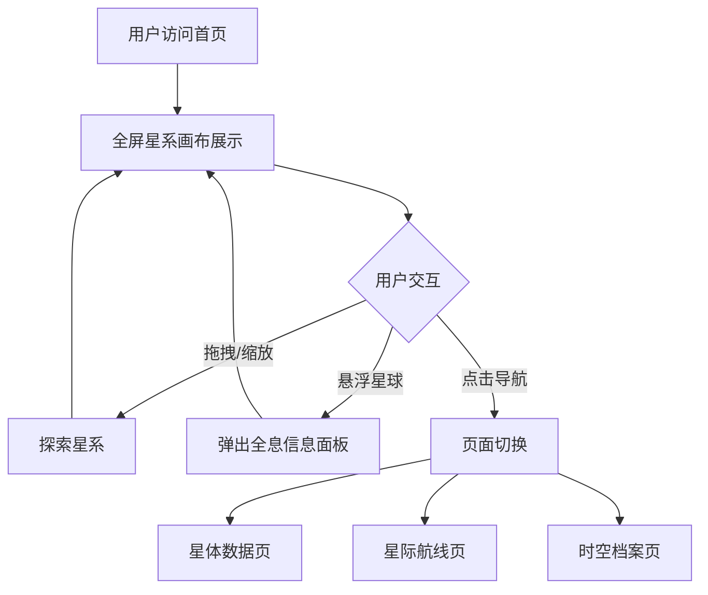

# 深空宇宙主题官网产品需求文档

## 1. 产品概述

构建一套4独立页面的深空宇宙主题官网，采用Next.js 14 + React TSX + Tailwind CSS + Framer Motion技术栈。整体氛围浩瀚无垠深空，静谧高级未来科技质感，全程无杂乱多余线条、无冗余UI。

- **主要目的**：打造沉浸式深空宇宙视觉体验，展示星系、星球、时空数据
- **目标用户**：科技爱好者、宇宙探索者、高端品牌访客
- **市场价值**：通过极致视觉体验传递品牌科技感与未来感

## 2. 核心功能

### 2.1 全局统一视觉与动效规则

1. **底层背景**：无边无际纯黑深空，遍布缓慢漂浮细碎星尘粒子，远处朦胧渐变星云，无限延伸空间
2. **核心载体GalaxyCanvas星系画布**：全屏多层环形轨道缓慢自转，轨道细银淡光流线，转速分层错落；轨道搭载多颗独立Planet星球组件，星球持续自转、地表光影明暗动态变化，跟随轨道循环移动；支持鼠标拖拽画布、滚轮缩放深空视野
3. **星球交互**：鼠标悬浮星球，弹出PlanetTooltip全息透明信息面板，展示星球时空数据，带柔和呼吸光效
4. **全局顶部固定HoloTimeBar全息时间栏**：半透磨砂玻璃科技UI，显示星际纪元、宇宙坐标、实时时空时间，数字持续滚动微动效，细流光横向扫描，固定不随星系画布移动
5. **UI风格**：全部采用低饱和深空玻璃拟态，冰蓝、银灰、淡紫柔光为主色调，拒绝刺眼霓虹、故障像素、杂乱金属构件
6. **页面切换**：采用星云淡入溶解过渡动画，全站统一粒子星空背景，所有页面共享星系交互逻辑
7. **响应式适配**：移动端自动简化粒子数量、放缓轨道动画速度，保留全部核心交互

### 2.2 页面详情

| 页面名称 | 模块名称 | 功能描述 |
|----------|----------|----------|
| 首页 - 星际总览页 | GalaxyCanvas星系画布 | 全屏超大星系轨道画布，多规格星球错落分布 |
| | HoloTimeBar全息时间栏 | 顶部固定，显示星际纪元、宇宙坐标、实时时空时间 |
| | 深空玻璃信息板块 | 页面底部多层，展示宇宙基础参数 |
| 星体数据页 /planets | 星系预览画布 | 左侧小型星系预览画布 |
| | 全息数据面板 | 右侧大尺寸，可点击星球调取详细时空、地质、轨道数据 |
| 星际航线页 /orbit | 扩张式环形轨道 | 多层扩张式环形轨道可视化，轨道标注航线距离 |
| | 星球环绕运转 | 星球匀速环绕运转 |
| | 航线计时参数 | 时间栏增加航线计时参数 |
| 时空档案页 /archive | 纵向时间轴 | 纵向滚动玻璃时间轴 |
| | 迷你星系预览 | 每个节点内嵌迷你星系动态预览 |
| | 纪元时间刻度 | 顶部全息时间栏切换纪元时间刻度 |

## 3. 核心流程

用户访问官网后的主要流程：

1. 用户进入首页，全屏星系画布展示，星球在轨道上缓慢运转
2. 用户可拖拽画布、滚轮缩放，探索星系
3. 鼠标悬浮星球，弹出全息信息面板查看时空数据
4. 通过导航切换到其他页面（星体数据页、星际航线页、时空档案页）
5. 页面切换时采用星云淡入溶解过渡动画
6. 各页面保持统一的深空宇宙视觉风格和交互逻辑

## 4. 用户界面设计

### 4.1 设计风格

- **主色调**：纯黑深空背景（#000000），冰蓝（#4A90E2、#5BA3F0）、银灰（#C0C0C0、#A8A8A8）、淡紫（#9B7EDE、#B19CD9）柔光
- **辅助色**：半透明白色（rgba(255,255,255,0.1-0.3)）用于玻璃拟态
- **按钮风格**：磨砂玻璃质感，细边框，悬停时柔和光晕扩散
- **字体**：
  - 标题：Orbitron（科技感等宽字体）
  - 正文：Rajdhani（现代科技字体）
  - 数据：Share Tech Mono（等宽数据字体）
- **布局风格**：全屏沉浸式，玻璃拟态卡片，大量留白，突出深空辽阔感
- **图标风格**：细线条线性图标，冰蓝色，极简科技风

### 4.2 页面设计概览

| 页面名称 | 模块名称 | UI元素 |
|----------|----------|--------|
| 首页 | GalaxyCanvas | 多层环形轨道，细银淡光流线，星球自转与光影变化，拖拽缩放交互 |
| | HoloTimeBar | 半透磨砂玻璃，星际纪元/宇宙坐标/实时时间，数字滚动动效，横向流光扫描 |
| | 信息板块 | 深空玻璃卡片，宇宙参数展示，呼吸光效边框 |
| 星体数据页 | 星系预览画布 | 小型化星系画布，可交互星球 |
| | 全息数据面板 | 大尺寸玻璃面板，星球详细数据，时空/地质/轨道参数，数据可视化图表 |
| 星际航线页 | 扩张式环形轨道 | 多层轨道可视化，航线距离标注，星球匀速运转 |
| | 航线计时 | 时间栏增加航线计时参数显示 |
| 时空档案页 | 纵向时间轴 | 玻璃质感时间轴，滚动交互 |
| | 迷你星系预览 | 每个时间节点内嵌小型动态星系 |
| | 纪元切换 | 时间栏支持纪元时间刻度切换 |

### 4.3 响应式适配

- **桌面端优先**：1920px及以上为基准设计
- **平板适配**：768px-1024px，调整布局比例，保持核心交互
- **移动端**：<768px，自动简化粒子数量（减少70%），放缓轨道动画速度（降低50%），保留拖拽缩放、星球悬浮等核心交互，导航改为汉堡菜单

### 4.4 动效与交互

- **粒子系统**：Canvas实现，星尘粒子缓慢漂浮，远处星云渐变
- **轨道动画**：CSS动画 + requestAnimationFrame，多层轨道分层转速
- **星球自转**：CSS transform持续旋转，地表光影通过渐变叠加实现明暗变化
- **悬浮交互**：Framer Motion实现Tooltip淡入淡出，呼吸光效通过opacity动画
- **页面过渡**：Framer Motion AnimatePresence，星云溶解效果（opacity + blur + scale）
- **拖拽缩放**：手势识别，transform matrix变换
- **数字滚动**：Framer Motion数字动画，逐位滚动效果
- **流光扫描**：CSS linear-gradient + animation，横向移动光带

### 4.5 视觉约束

- **禁止**：多余杂乱线条、冗余管道/管线类装饰、刺眼霓虹色、故障像素效果、杂乱金属构件
- **要求**：画面留白充足，突出深空辽阔虚无的宏大氛围，整体克制简约，高级科幻质感
