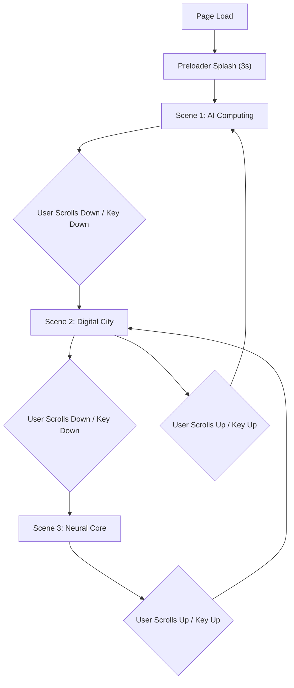

## 1. Product Overview

A luxury AI computing brand landing hero page built with Next.js, React TSX, Tailwind CSS, and Framer Motion. The page delivers an immersive luxury experience through frosted glass layers, holographic video panels, and smooth scene transitions — positioning the brand as a premium AI infrastructure provider.

- **Target Users**: Enterprise CTOs, tech investors, AI researchers seeking premium AI computing solutions
- **Core Value**: Convey cutting-edge AI computing power through a refined, luxury visual language without aggressive cyberpunk aesthetics

## 2. Core Features

### 2.1 Feature Module

1. **Preloader Splash Screen**: 3-second brand intro with floating particles and marble fabric texture overlay
2. **Luxury Hero Canvas**: Main component orchestrating all scenes, glass layers, and video panels
3. **Scene Switching System**: 3 built-in scene themes switchable via mouse wheel and keyboard up/down arrows
4. **Holographic Video Panels**: Floating semi-transparent video windows playing looping computing/digital city clips
5. **Glassmorphism Layer System**: Frosted transparent glass with liquid acrylic stacked layers and refraction light ripple

### 2.2 Page Details

| Page Name | Module Name | Feature Description |
|-----------|-------------|---------------------|
| Hero Page | Preloader | 3-second splash with particle GIF background, brand logo fade-in, marble texture overlay |
| Hero Page | Scene 1 - AI Computing | Frosted glass panels, floating videos showing data center/server clips, tagline overlay |
| Hero Page | Scene 2 - Digital City | Glass layers with cityscape hologram videos, CTA button, brand statement |
| Hero Page | Scene 3 - Neural Core | Acrylic stacked layers, neural network visualization video, contact section |
| Hero Page | Navigation Dots | Minimal scene indicator dots on the right side, auto-highlight current scene |

## 3. Core Process

## 4. User Interface Design

### 4.1 Design Style

- **Primary Colors**: Ice white (#F0F4F8), Titanium silver (#C0C8D4), Low-saturation cyan (#7EB8C9)
- **Accent**: Subtle cyan glow (#A3D5E0), Frosted glass white with 0.15 opacity
- **Background**: Deep charcoal (#1A1D24) with marble fabric texture
- **Typography**: Cormorant Garamond (serif, headlines), Montserrat (sans-serif, body)
- **Layout**: Full-viewport canvas, centered content, glass overlays
- **Glass Effects**: backdrop-blur-xl, semi-transparent backgrounds, light refraction animation

### 4.2 Page Design Overview

| Page Name | Module Name | UI Elements |
|-----------|-------------|-------------|
| Hero Page | Preloader | Full-screen overlay, logo center, floating particles, marble texture, fade-out transition |
| Hero Page | Scene Container | Full-viewport, video panels floating at varying depths, glass layer stack, text overlays |
| Hero Page | Video Panels | Rounded-2xl, semi-transparent, framer-motion float animation, muted autoplay loop |
| Hero Page | Scene Indicators | 3 vertical dots, subtle glow on active, positioned right-center |
| Hero Page | Glass Layers | Stacked divs with backdrop-blur, border-white/10, slow breathing animation |

### 4.3 Responsiveness

- Desktop-first design approach
- Mobile: Video panels scale down, text sizes reduce, glass layers stack vertically
- Tablet: Maintain layout but reduce video panel count
- Touch: Swipe up/down to switch scenes on mobile

## 5. Non-Functional Requirements

- All media links must be accessible in China (commercial-free)
- No cyberpunk/glitch effects — soft subtle light only
- Hide all native video controls
- Support mouse wheel and keyboard navigation
- Fully runnable without external API dependencies