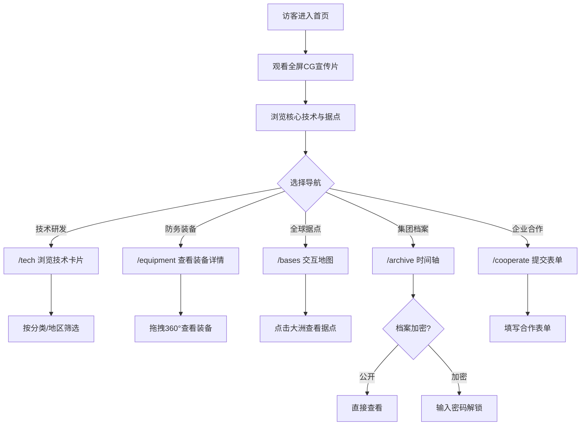

# 哈夫克（HAAVK）跨国科技防务集团 — 产品需求文档

## 1. 产品概述

哈夫克集团官方企业官网，基于《三角洲行动》游戏正统世界观，构建架空2035年跨国科技防务财团的数字门户。面向投资者、合作方、潜在雇员及游戏世界观爱好者，展示集团核心技术、全球据点、防务装备、机密档案与企业合作信息，塑造冷峻、精密、威权的近未来军工科技巨头品牌形象。

- 目标用户：游戏世界观爱好者、潜在商业合作方、科技防务行业关注者
- 核心价值：沉浸式世界观体验 + 企业信息展示 + AI智能助手交互

## 2. 核心功能

### 2.1 用户角色

| 角色 | 访问方式 | 核心权限 |
|------|----------|----------|
| 普通访客 | 直接访问 | 浏览全部公开页面、观看CG短片、查看公开档案 |
| 授权访客 | 档案页密码验证 | 解锁受限机密与最高保密档案内容 |

### 2.2 功能模块

1. **首页（/）**：全屏CG宣传片、集团核心技术展示、全球据点分布预览、基建成果展示、集团起源叙事
2. **核心技术页（/tech）**：分类侧边栏筛选、技术数据卡片网格、微型CG片段演示、地区/机密等级筛选
3. **装备详情页（/equipment/[id]）**：360°装备预览、实战CG短片、装备参数面板、据点背景剧情
4. **全球据点页（/bases）**：交互式世界地图、全息据点弹窗、时区/汇率切换
5. **集团档案页（/archive）**：金属时间轴叙事、CG预览窗口、分级加密档案
6. **企业合作页（/cooperate）**：多层表单面板、CG宣传片、合作/招聘信息

### 2.3 页面详情

| 页面名称 | 模块名称 | 功能描述 |
|----------|----------|----------|
| 首页 | 全息CG窗口 | 16:9宽幅UE5电影级CG短片循环播放，自动静音 |
| 首页 | 核心优势展示 | 曼德尔超算、天网卫星、零号大坝、航天基建四组数据卡片 |
| 首页 | 全球据点地图 | 交互式世界地图缩略版，标注四大核心据点 |
| 首页 | 集团起源叙事 | 雅各布·哈夫克创立故事，时间线叙事板块 |
| 首页 | 页脚据点坐标 | 航天基地、零号大坝、潮汐监狱、哈夫克尖塔坐标 |
| 技术页 | 分类侧边栏 | 曼德尔超算AI、天网卫星、Relink脑机、航天工程、新能源、防务装备 |
| 技术页 | 技术数据卡片 | 含微型CG片段、技术参数、落地项目 |
| 装备页 | 360°预览器 | 可拖拽旋转装备模型，侧边CG短片 |
| 装备页 | 信息面板 | 研发溯源、能耗参数、部署方案、据点剧情 |
| 据点页 | 世界地图画布 | 点击大洲弹出据点详情弹窗 |
| 据点页 | 全息时间栏 | 时区切换、哈夫币汇率同步 |
| 档案页 | 时间轴 | 纵向金属时间轴，关键事件节点，分级加密 |
| 档案页 | CG预览窗 | 每个时间节点悬浮迷你CG预览 |
| 合作页 | 表单面板 | 能源合作、安保服务、人才招募三板块 |
| 合作页 | CG宣传片 | 侧边小型集团基建宣传CG |
| 全局 | HoloGlobalNav | 顶部全息导航栏，滚动渐变磨砂效果 |
| 全局 | 全息时间栏 | 星际纪元、宇宙坐标、实时时间，固定顶部 |
| 全局 | 星尘粒子 | 全屏底层缓慢漂浮粒子背景 |
| 全局 | HAAVK AI | OpenAI驱动的哈夫克AI助手对话窗口 |

## 3. 核心流程

## 4. 用户界面设计

### 4.1 设计风格

- **主色调**：哑光炭黑 (#0D0D0D)、石墨深灰 (#1A1A1F)、雾面冷银 (#A8B4C0)、铂灰金属 (#8A959F)
- **强调色（仅数据高亮）**：极淡冰蓝 (#7EB8DA)
- **按钮风格**：极简金属边框按钮，悬停时冰蓝细线流光扫描边框
- **字体**：标题使用 Orbitron（科幻感），正文使用 Rajdhani（精密工业感），中文回退使用系统字体
- **布局风格**：纵深悬浮多层布局，大面积留白，精密金属分割线
- **图标风格**：极简线性军工图标，1px细线勾勒

### 4.2 页面设计概览

| 页面名称 | 模块名称 | UI元素 |
|----------|----------|--------|
| 首页 | 全息CG窗口 | 16:9宽幅视频，哑光金属边框，四角精密铆钉装饰，冰蓝扫描线 |
| 首页 | 核心优势卡片 | 磨砂玻璃面板，悬浮微动效，金属边框流光加速，数据滚动计数 |
| 首页 | 据点缩略地图 | 深色地图画布，冷银坐标标记，脉冲光点动画 |
| 首页 | 起源叙事 | 纵向金属分割线，文字淡入，左侧年份标记 |
| 技术页 | 分类侧边栏 | 左侧固定，精密金属列表，选中项冰蓝高亮线 |
| 技术页 | 技术卡片 | 网格排布，玻璃面板，微型CG嵌入，参数表格 |
| 装备页 | 360°预览 | 左侧大面积画布，拖拽旋转，侧边悬浮CG |
| 装备页 | 信息面板 | 雾面全息玻璃，分层数据，冰蓝数值高亮 |
| 据点页 | 世界地图 | 全屏交互画布，极简工业风格，大洲轮廓金属线 |
| 据点页 | 据点弹窗 | 全息玻璃面板，安保等级图标，产能数据 |
| 档案页 | 时间轴 | 纵向居中金属线，左右交替事件卡片，CG预览窗 |
| 合作页 | 表单面板 | 磨砂金属玻璃，输入框金属边框，聚焦冰蓝流光 |

### 4.3 响应式设计

- **桌面端（>=1024px）**：完整多栏布局，全部粒子特效，360°预览器，交互地图
- **平板端（768-1023px）**：双栏布局，侧边栏折叠，地图简化，粒子数量减半
- **移动端（<768px）**：单栏布局，抽屉式金属导航，CG窗口缩小，粒子数量大幅减少，保留全部核心功能

### 4.4 动效规范

- 页面切换：石墨灰缓慢溶解淡入（Framer Motion AnimatePresence）
- 数据卡片悬浮：translateY(-4px) + 金属边框流光加速
- 导航栏：scrollY > 50 时从透明渐变至磨砂金属玻璃
- 数值载入：useSpring 滚动计数动画
- 星尘粒子：Canvas 全屏底层持续缓慢漂浮
- 扫描线：CSS animation 匀速横向扫描贯穿所有UI边框