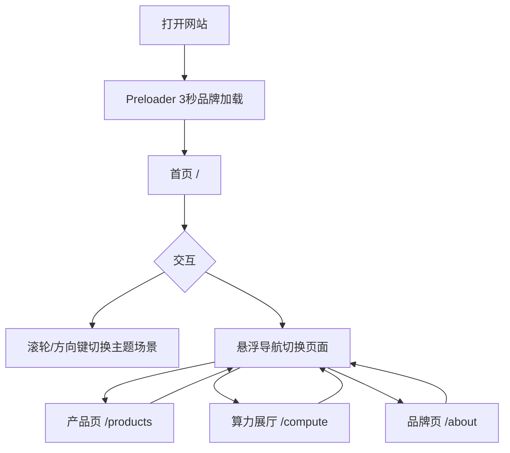

# MAISON ÉCLAT 高端科技品牌官网 - 产品需求文档

## 1. 产品概述

本项目为 MAISON ÉCLAT 高端科技品牌的多页面沉浸式官网，核心目标是通过透明磨砂玻璃、全息悬浮视频、微光粒子与挡风玻璃视觉层，营造「未来车内算力空间」的冷调轻奢氛围。

目标用户为关注高性能计算、智慧城市、数字基础设施的企业客户与品牌受众；网站以视觉冲击与丝滑动效传递技术领先与高端质感。

## 2. 核心功能

### 2.1 用户角色

| 角色 | 访问方式 | 核心权限 |
|------|----------|----------|
| 访客 | 直接访问 | 浏览首页、产品页、算力展厅、品牌页，观看动效与视频 |

### 2.2 功能模块

1. **Preloader 品牌加载**：全屏 3 秒品牌文字缩放淡入开场。
2. **InvisibleNav 隐形导航**：右侧悬浮细条，鼠标靠近滑出，支持四页面切换。
3. **ParticleBackground 粒子背景**：全站循环漂浮银白光点与青色数据流光带。
4. **GlassPanel 玻璃容器**：半透磨砂、亚克力分层、呼吸浮动，全站卡片与大屏复用。
5. **HologramVideo 全息视频窗口**：半透明边框、呼吸缩放、自动静音循环播放。
6. **WindshieldOverlay 挡风玻璃层**：首页专属前景，弧形玻璃边框轻微晃动。
7. **四页面内容**：
   - 首页：场景切换、全息视频矩阵、挡风玻璃、玻璃空间层。
   - 产品页：横向拖拽滚动玻璃产品墙。
   - 算力展厅：鼠标视差、数据流光、巨型全息视频墙、镜面地面。
   - 品牌页：时间轴滚动触发、丝绸纹理、漂浮粒子、节点视频。

### 2.3 页面功能详情

| 页面名称 | 模块名称 | 功能描述 |
|----------|----------|----------|
| 首页 / | WindshieldOverlay | 全屏透明弧形挡风玻璃前景，持续轻微晃动 |
| 首页 / | 主题场景切换 | 滚轮或上下方向键切换 3 套背景场景 |
| 首页 / | 全息视频矩阵 | 4 个 HologramVideo 窗口循环播放算力/数字城市短片 |
| 首页 / | 玻璃空间层 | 三层 GlassPanel 悬浮，营造景深 |
| 产品页 /products | 横向拖拽墙 | 鼠标拖拽横向滚动玻璃产品卡片 |
| 产品页 /products | 产品卡片 | 每个卡片内置小型 HologramVideo 与产品信息 |
| 算力展厅 /compute | 鼠标视差 | 所有玻璃层随光标轻微偏移 |
| 算力展厅 /compute | 数据流光 | 垂直贯穿页面的青色流光带动效 |
| 算力展厅 /compute | 全息大屏墙 | 多组巨型 HologramVideo 同步循环运算画面 |
| 算力展厅 /compute | 镜面地面 | 底部反射视频与粒子光影 |
| 品牌页 /about | 时间轴 | 向下滚动依次触发玻璃节点淡入与柔光渐亮 |
| 品牌页 /about | 节点视频 | 每个时间节点内嵌小型循环动态视频 |

## 3. 核心流程

访客打开网站后，首先看到 3 秒 Preloader 品牌加载动画；加载完成后进入首页。首页默认展示挡风玻璃前景与粒子背景，访客可通过滚轮或上下方向键切换 3 套主题场景，鼠标悬停右侧悬浮条展开 InvisibleNav 进行页面切换。进入产品页后可横向拖拽浏览玻璃产品卡片；进入算力展厅后鼠标移动触发玻璃视差与流光；进入品牌页后向下滚动触发时间轴节点依次浮现。

## 4. 用户界面设计

### 4.1 设计风格

- **主色调**：深邃黑 `#050507`、冷银白 `#E8EAEF`、冰青蓝 `#22D3EE`。
- **辅助色**：玻璃白 `rgba(255,255,255,0.05)`、边框白 `rgba(255,255,255,0.10)`、镜面灰 `rgba(255,255,255,0.02)`。
- **按钮/交互**：无传统按钮，使用隐形悬浮条与玻璃卡片 hover 发光反馈。
- **字体**：品牌显示字体使用 `Cinzel`（奢侈品衬线），正文使用 `Urbanist`（几何无衬线），强调未来感与高级感。
- **布局**：全屏沉浸式，非对称层次叠加，玻璃卡片悬浮于粒子与视频之上。
- **图标**：极简线性，仅导航与滚动提示使用 1px 描边图标。

### 4.2 页面设计概览

| 页面名称 | 模块名称 | UI 元素 |
|----------|----------|---------|
| 首页 / | Hero | 挡风玻璃前景、3 层 GlassPanel、4 个 HologramVideo、粒子背景、场景切换指示 |
| 产品页 /products | 产品墙 | 横向拖拽容器、玻璃产品卡片、小型全息视频、产品标题与描述 |
| 算力展厅 /compute | 展厅 | 巨型全息视频墙、视差玻璃层、垂直数据流光、镜面地面反射 |
| 品牌页 /about | 时间轴 | 丝绸纹理背景、时间轴玻璃节点、小型循环视频、品牌历程文案 |

### 4.3 响应式策略

- 采用桌面优先设计（最小宽度 1280px 为理想画布）。
- 大屏（≥1440px）扩展全息视频尺寸与玻璃间距。
- 平板/小屏（<1024px）简化视差强度，产品墙改为触控滑动，导航条保持右侧悬浮。
- 移动端（<768px）隐藏部分装饰性玻璃层，保留核心内容与基础动效。

### 4.4 动效指导

- **全局氛围**：粒子缓慢漂浮，光带横向/纵向流动，使用 `framer-motion` 无限循环。
- **玻璃呼吸**：GlassPanel 持续 `y: [0, 8, 0]` 与轻微 `scale` 变化，周期 4–6 秒。
- **视频窗口**：HologramVideo 边框发光脉冲，视频自动静音循环。
- **转场**：页面切换使用 `template.tsx` 统一淡入淡出。
- **加载**：Preloader 文字从 0.8 放大到 1 并淡入，3 秒后退出。
- **限制**：禁止使用 glitch、廉价霓虹闪烁、高饱和彩虹渐变；保持冷调、克制、奢华。
