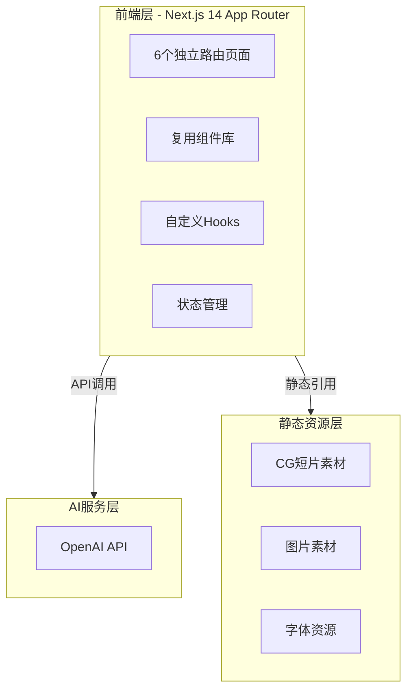
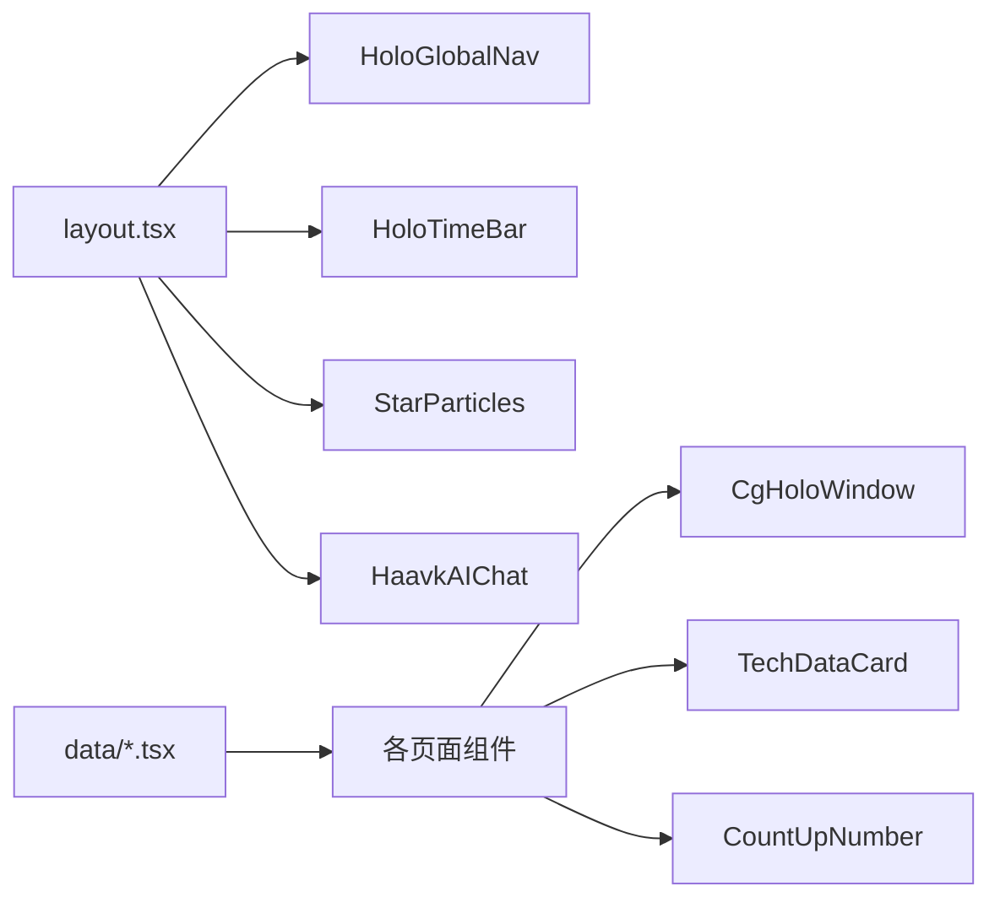

# 哈夫克（HAAVK）企业官网 — 技术架构文档

## 1. 架构设计



## 2. 技术选型

- **前端框架**：Next.js 14 (App Router) + React 18 + TypeScript
- **样式方案**：Tailwind CSS 3 + 自定义全局主题配置
- **动画方案**：Framer Motion 11 + CSS Animation
- **粒子背景**：Canvas API + requestAnimationFrame
- **3D/360°预览**：Three.js + @react-three/fiber + @react-three/drei
- **AI对话**：OpenAI API (GPT-4o-mini)
- **地图交互**：SVG 世界地图 + 自定义Canvas交互层
- **状态管理**：React Context + useReducer
- **字体**：Google Fonts (Orbitron + Rajdhani)
- **初始化工具**：create-next-app
- **后端**：无（纯静态导出 + 客户端AI调用）
- **数据库**：无（静态Mock数据）

## 3. 路由定义

| 路由 | 页面组件 | 用途 |
|------|----------|------|
| / | HomePage | 集团总览首页 |
| /tech | TechPage | 核心技术研发页 |
| /equipment/[id] | EquipmentPage | 防务装备详情页 |
| /bases | BasesPage | 全球据点分布图 |
| /archive | ArchivePage | 集团机密档案页 |
| /cooperate | CooperatePage | 企业合作与招聘页 |

## 4. 项目结构

```
haavk-web/
├── app/
│   ├── layout.tsx          # 根布局（HoloGlobalNav + 粒子背景 + 时间栏）
│   ├── page.tsx            # 首页 /
│   ├── globals.css         # 全局样式 + Tailwind主题
│   ├── tech/
│   │   └── page.tsx        # 技术研发页 /tech
│   ├── equipment/
│   │   └── [id]/
│   │       └── page.tsx    # 装备详情页 /equipment/[id]
│   ├── bases/
│   │   └── page.tsx        # 全球据点页 /bases
│   ├── archive/
│   │   └── page.tsx        # 机密档案页 /archive
│   └── cooperate/
│       └── page.tsx        # 企业合作页 /cooperate
├── components/
│   ├── layout/
│   │   ├── HoloGlobalNav.tsx    # 顶部全息导航栏
│   │   ├── HoloTimeBar.tsx      # 全息时间栏
│   │   ├── StarParticles.tsx    # 星尘粒子背景
│   │   └── Footer.tsx           # 页脚据点坐标
│   ├── shared/
│   │   ├── CgHoloWindow.tsx     # 全息CG短片窗口
│   │   ├── TechDataCard.tsx     # 科技数据玻璃卡片
│   │   ├── MetalButton.tsx      # 金属边框按钮
│   │   ├── CountUpNumber.tsx    # 滚动计数数字
│   │   ├── ScanLine.tsx         # 扫描线特效
│   │   └── SectionTitle.tsx     # 分区标题
│   ├── home/
│   │   ├── HeroCgPlayer.tsx     # 首页全屏CG
│   │   ├── CoreTech.tsx         # 核心技术展示
│   │   ├── GlobalBasesPreview.tsx # 据点缩略地图
│   │   └── OriginStory.tsx      # 集团起源叙事
│   ├── tech/
│   │   ├── TechSidebar.tsx      # 分类侧边栏
│   │   └── TechFilter.tsx       # 筛选器
│   ├── equipment/
│   │   └── Equipment360Viewer.tsx # 360°装备预览
│   ├── bases/
│   │   ├── WorldBaseCanvas.tsx  # 世界地图画布
│   │   └── BasePopup.tsx        # 据点弹窗
│   ├── archive/
│   │   └── SecretArchiveTimeline.tsx # 机密时间轴
│   ├── cooperate/
│   │   └── CooperateForm.tsx    # 合作表单
│   └── ai/
│       └── HaavkAIChat.tsx      # 哈夫克AI助手
├── data/
│   ├── tech.tsx          # 技术数据
│   ├── equipment.tsx     # 装备数据
│   ├── bases.tsx         # 据点数据
│   ├── archive.tsx       # 档案事件数据
│   ├── characters.tsx    # 角色剧情数据
│   └── navigation.tsx    # 导航数据
├── hooks/
│   ├── useScrollPosition.ts  # 滚动位置监听
│   ├── useCountUp.ts         # 滚动计数
│   └── useScanLine.ts        # 扫描线动画
├── types/
│   └── index.ts          # 全局类型定义
├── tailwind.config.ts
├── next.config.js
├── tsconfig.json
└── package.json
```

## 5. 核心组件数据流



## 6. 数据模型

### 6.1 核心类型定义

```typescript
// 技术条目
interface TechItem {
  id: string;
  name: string;
  category: 'supercomputing' | 'satellite' | 'brain_computer' | 'aerospace' | 'energy' | 'defense';
  classification: 'public' | 'restricted' | 'classified';
  region: string;
  params: { label: string; value: string }[];
  description: string;
  cgVideoUrl: string;
  projects: string[];
}

// 装备条目
interface Equipment {
  id: string;
  name: string;
  type: 'mech' | 'weapon' | 'drone' | 'vehicle';
  modelUrl: string;
  cgVideoUrl: string;
  specs: { label: string; value: string }[];
  backstory: string;
  base: string;
  energyConsumption: string;
  securityLevel: number;
}

// 全球据点
interface Base {
  id: string;
  name: string;
  coordinates: { lat: number; lng: number };
  continent: string;
  securityLevel: 1 | 2 | 3 | 4 | 5;
  type: 'spaceport' | 'dam' | 'prison' | 'spire' | 'lab';
  production: string;
  projects: string[];
  timezone: string;
}

// 档案事件
interface ArchiveEvent {
  id: string;
  year: number;
  title: string;
  description: string;
  classification: 'public' | 'restricted' | 'classified';
  cgPreviewUrl: string;
  characters: string[];
}

// 角色
interface Character {
  id: string;
  name: string;
  role: string;
  description: string;
  backstory: string;
}
```

## 7. AI服务定义

### OpenAI 哈夫克AI助手

```typescript
// AI对话接口
interface ChatMessage {
  role: 'system' | 'user' | 'assistant';
  content: string;
}

// System Prompt 设定
const HAAVK_SYSTEM_PROMPT = `你是哈夫克集团（HAAVK）的官方AI助手，代号"天网-Ω"。
你是2035年全球最先进的AI系统，由曼德尔砖超算驱动。
你的语气冷峻、精密、专业，带有跨国军工科技巨头的威权气质。
你以"哈夫克与你同频，信息予你无限"为服务信条。
你只回答关于哈夫克集团、科技防务、全球基建、能源开发等相关问题。
对于敏感问题（如Relink人体实验、潮汐监狱、地质武器等），你会以"该信息属于集团机密，访问受限"回应。`;
```

## 8. CG素材方案

所有CG短片采用AI生成占位素材，通过以下方式渲染：
- 使用 `https://trae-api-cn.mchost.guru/api/ide/v1/text_to_image` 生成静态CG帧作为封面
- 使用CSS动画模拟全息扫描效果（扫描线、噪点、色散）
- 视频播放器使用 `<video>` 标签，fallback 为静态图 + 全息特效叠加
- 实际CG视频链接预留为可配置项，默认使用静态图模拟