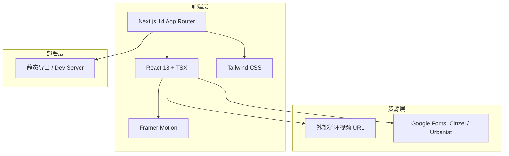

# MAISON ÉCLAT 官网 - 技术架构文档

## 1. 架构设计



## 2. 技术描述

- **前端框架**：Next.js 14（App Router）+ React 18 + TypeScript TSX。
- **样式方案**：Tailwind CSS 3.4，通过 `@tailwind` 指令与自定义配置实现玻璃拟态、渐变与响应式布局。
- **动画库**：Framer Motion 负责页面转场、无限循环呼吸动画、视差偏移、滚动触发与加载动画。
- **字体**：通过 `next/font/google` 加载 Cinzel（品牌衬线）与 Urbanist（正文几何无衬线）。
- **视频资源**：使用 Pexels / Coverr 等提供的免版税商用循环视频 URL，自动静音循环播放。
- **无后端**：所有内容写死为 TSX 组件与常量，无需 API 与数据库。

## 3. 路由定义

| 路由 | 用途 |
|------|------|
| / | 首页：挡风玻璃前景、主题场景切换、4 个全息视频、玻璃空间层 |
| /products | 产品页：横向拖拽滚动玻璃产品墙 |
| /compute | 算力展厅：鼠标视差、数据流光、全息大屏墙、镜面地面 |
| /about | 品牌页：滚动触发时间轴、丝绸纹理、节点视频 |

## 4. 组件结构

```
app/
├── layout.tsx                # 全局根布局：字体、Metadata、全屏容器
├── template.tsx              # 全局页面切换动画：淡入淡出
├── page.tsx                  # 首页
├── products/page.tsx         # 产品页
├── compute/page.tsx          # 算力展厅
└── about/page.tsx            # 品牌页
components/
├── Preloader.tsx             # 3 秒品牌加载动画
├── InvisibleNav.tsx          # 右侧隐形悬浮导航
├── ParticleBackground.tsx    # 全站粒子与数据流光背景
├── GlassPanel.tsx            # 通用透明磨砂玻璃容器
├── HologramVideo.tsx         # 全息悬浮视频窗口
└── WindshieldOverlay.tsx     # 首页挡风玻璃前景
```

## 5. 关键动效实现逻辑

| 动效 | 实现方式 |
|------|----------|
| 玻璃呼吸浮动 | `motion.div` + `animate={{ y: [0, 8, 0], scale: [1, 1.01, 1] }}` + `transition={{ repeat: Infinity, duration: 5 }}` |
| 粒子漂浮 | 多个 `motion.div` 圆点，随机 `x/y` 无限循环，低透明度 |
| 数据流光带 | 长条 `motion.div` 沿 `x` 或 `y` 轴无限平移，带模糊与渐变 |
| 全息视频呼吸 | 外层边框 `boxShadow` 脉冲 + 容器 `scale` 微动 |
| 页面转场 | `AnimatePresence` + `motion.div` 初始 `opacity:0` 到 `opacity:1`，退出反向 |
| 鼠标视差 | `useMotionValue` / `useTransform` 监听 `mousemove`，映射到玻璃层 `x/y` 偏移 |
| 滚动触发 | `whileInView` + `viewport={{ once: true, amount: 0.3 }}` 实现时间轴节点淡入 |
| 主题切换 | React `useState` + `useEffect` 监听 `wheel` 与 `keydown`（ArrowUp/ArrowDown），切换场景索引 |
| 横向拖拽 | `motion.div` `drag="x"` + `dragConstraints` 实现产品墙拖拽滚动 |

## 6. 性能与体验约束

- 所有视频必须设置 `muted`、`loop`、`playsInline`、`preload="metadata"`，避免自动播放被浏览器拦截。
- 粒子数量控制在 40–60 个，使用 CSS 变换而非布局属性动画，避免重排。
- 使用 `will-change-transform` 与 GPU 加速的 `translate3d`。
- 静态导出配置 `output: 'export'` 与 `distDir: 'dist'`，便于部署预览。
