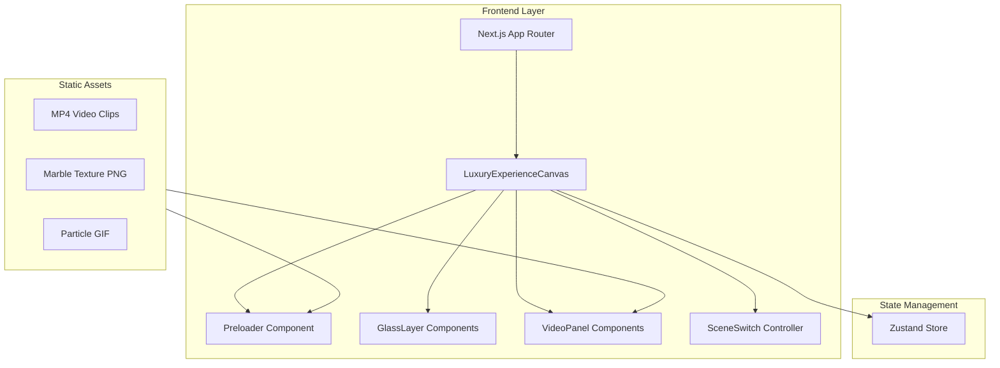

## 1. Architecture Design



## 2. Technology Description

- **Frontend**: Next.js 14 + React 18 + TypeScript
- **Styling**: Tailwind CSS 3.4 + custom CSS variables
- **Animation**: Framer Motion 11
- **State Management**: Zustand
- **Icons**: lucide-react
- **Fonts**: Cormorant Garamond + Montserrat (Google Fonts)
- **Initialization**: vite-init with react-ts template (adapted for Next.js)

## 3. Route Definitions

| Route | Purpose |
|-------|---------|
| / | Luxury brand hero page with all scenes |

## 4. Component Architecture

```
src/
  components/
    LuxuryExperienceCanvas.tsx   # Main orchestrator component
    Preloader.tsx                 # 3-second splash screen
    GlassLayer.tsx               # Reusable frosted glass layer
    VideoPanel.tsx               # Holographic floating video window
    SceneIndicator.tsx           # Scene navigation dots
    SceneContent.tsx             # Scene-specific content renderer
  hooks/
    useSceneSwitch.ts            # Scroll wheel + keyboard scene switching
    usePreloader.ts              # Preloader timing logic
  store/
    useAppStore.ts               # Zustand global state
  pages/
    index.tsx                    # Entry page
  styles/
    globals.css                  # Tailwind directives + custom styles
```

## 5. State Management (Zustand)

```typescript
interface AppState {
  currentScene: number;        // 0, 1, 2
  isPreloading: boolean;
  isTransitioning: boolean;
  setScene: (scene: number) => void;
  finishPreloading: () => void;
}
```

## 6. Video Asset Sources

All videos use commercial-free, China-accessible CDN links:
- AI Computing clip: Pexels/Pixabay royalty-free MP4
- Digital City clip: Pexels/Pixabay royalty-free MP4
- Neural Network clip: Pexels/Pixabay royalty-free MP4

## 7. Key Technical Decisions

- Use `useRef` + `wheel` event listener for scroll-based scene switching with debounce
- `backdrop-filter: blur()` with low opacity for glass effect
- Framer Motion `useScroll` + `useTransform` for parallax glass refraction
- CSS `@keyframes` for subtle glow pulse on glass edges
- Next.js static export for simple deployment