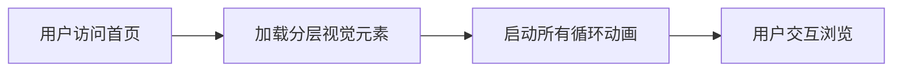

## 1. 产品概述

高科技AI品牌官网全屏首页，采用极简未来主义赛博奢华风格，展现AI大模型算力与智能数字空间主题。

- 目标用户：企业客户、技术合作伙伴、AI领域投资者
- 产品价值：通过极致视觉设计展现品牌技术实力与未来感

## 2. 核心特性

### 2.1 功能模块

1. **首页**：全屏高透磨砂玻璃背景、多层半透明悬浮玻璃面板、动态粒子效果、半透明全息视频窗口、导航栏

### 2.2 页面详情

| 页面名称 | 模块名称 | 功能描述 |
|-----------|-------------|---------------------|
| 首页 | 背景层 | 浅景深模糊背景、远处量子服务器轮廓、镜面反光地面、流动粒子动画 |
| 首页 | 玻璃图层 | 多层交错悬浮透明玻璃面板、水波纹动态折射效果、边缘冷银辉光 |
| 首页 | 视频窗口 | 多个悬浮半透全息视频窗口，循环播放芯片运行、数字城市、AI机房动态短片 |
| 首页 | 文本层 | 透明全息发光字体，品牌名称、标语、导航链接 |
| 首页 | 动态效果 | 漂浮光点、水平数据流、玻璃微浮动、呼吸缩放动画 |

## 3. 核心流程

用户访问官网 → 呈现全屏视觉盛宴 → 动态元素循环动画 → 用户可滚动或导航到其他页面

## 4. 用户界面设计

### 4.1 设计风格

- **主色调**：浅银灰、冰蓝、浅钛白，低饱和冷色调
- **点缀色**：霓虹青色微光线条
- **材质**：高透磨砂玻璃、半透明液态亚克力、悬浮透明面板、PBR物理透明材质
- **字体**：纤细线条、透明全息发光字体
- **布局**：宽屏水平构图、大量留白、深空间层次感、浅景深
- **光影**：柔和全局环境光、漫射柔光、无硬阴影、镜头光晕、胶片噪点质感

### 4.2 页面设计概览

| 页面名称 | 模块名称 | UI元素 |
|-----------|-------------|-------------|
| 首页 | 背景层 | 浅景深模糊、远处透明量子服务器轮廓、镜面反光地面、循环粒子流动画、漂浮光点 |
| 首页 | 玻璃面板层 | 多层交错悬浮、高透磨砂材质、边缘冷银辉光、水波纹折射动画、缓慢浮动位移 |
| 首页 | 视频窗口 | 半透明悬浮、循环播放动态短片、背景叠加、呼吸缩放微动 |
| 首页 | 文字导航 | 透明全息发光字体、纤细线条、悬浮在玻璃层上方、平滑微动画 |

### 4.3 响应式设计

- 桌面优先设计，适配主流显示屏宽高比
- 支持16:9宽屏，在不同分辨率下保持核心视觉效果

### 4.4 动态效果指引

- **环境与光影**：柔和全局漫射光，无硬阴影，电影级光影效果
- **动态元素**：
  - 技术粒子：全屏循环流动，缓慢漂移
  - 漂浮光点：上下缓慢浮动
  - 数据流：水平缓慢流动
  - 玻璃面板：缓慢浮动位移微动画
  - 视频窗口：轻微呼吸缩放动画
  - 玻璃表面：水波纹动态折射效果
- **材质**：PBR物理透明材质，真实折射反光
- **构图**：纵深立体空间，浅景深虚化背景，平衡大气布局
- **后期**：细腻胶片噪点质感，柔焦镜头光晕
