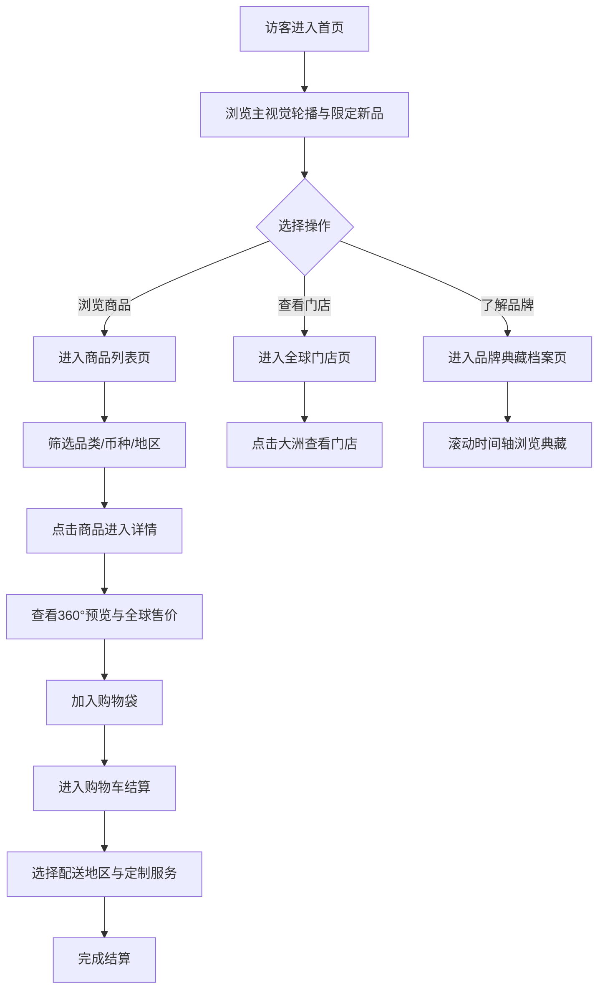

## 1. 产品概述

HAVOK LUXURY 全球顶奢购物平台，复刻三角洲游戏内 Havok（哈夫克）集团冷峻极简工业奢感设计语言，打造融合军事化精密美学与奢侈品优雅格调的高端数字购物体验。面向全球高净值用户，提供腕表、高定服饰、珠宝、豪车配饰、高端数码、典藏藏品六大品类顶奢商品的浏览、查询与结算服务。

## 2. 核心功能

### 2.1 用户角色

| 角色 | 说明 |
|------|------|
| 访客 | 浏览全站商品、门店、品牌档案，无需登录 |
| VIP 用户 | 浏览商品、加入购物袋、结算、查看全球门店 |

### 2.2 功能模块

1. **首页**：电影级主视觉轮播、全球限定新品、旗舰系列、线下门店地图入口、集团品牌故事
2. **全品类商品列表页**：左侧分类侧边栏、右侧网格商品卡片、多条件筛选
3. **单品详情页**：360° 商品预览、品牌溯源、全球售价、多地区库存、购物袋
4. **购物车结算页**：订单面板、全球税费、跨境运费、多币种总价、配送地区选择
5. **全球线下门店页**：交互式世界地图、大洲门店弹窗、预约服务
6. **品牌典藏档案页**：金属时间轴布局、品牌百年典藏系列

### 2.3 页面详细

| 页面名称 | 模块名称 | 功能描述 |
|----------|----------|----------|
| 首页 | 主视觉轮播 | 全屏宽幅电影级单品轮播，冷调商业大片光影 |
| 首页 | 全球限定新品 | 横向卡片流展示最新限定单品 |
| 首页 | 旗舰系列 | 品牌旗舰系列精选展示 |
| 首页 | 全球门店入口 | 地图预览 + 链接跳转 /stores |
| 首页 | 集团品牌故事 | 极简工业文字排版，介绍集团历史 |
| 商品列表 | 分类侧边栏 | 六大品类固定侧边栏，选中高亮 |
| 商品列表 | 商品网格 | 1:1 哑光质感卡片，单品图、品牌名、价格、库存 |
| 商品列表 | 筛选栏 | 多币种、全球地区库存、限定款筛选 |
| 单品详情 | 商品画廊 | 左侧超大高清多角度预览，拖拽 360° 旋转 |
| 单品详情 | 信息面板 | 雾面玻璃面板，品牌溯源、全球售价、库存、定制化服务 |
| 单品详情 | 品牌专柜地图 | 底部该品牌全球线下专柜分布 |
| 购物车 | 订单面板 | 多层磨砂金属玻璃面板，单品、税费、运费、总价 |
| 购物车 | 结算表单 | 哑光金属边框输入框，配送地区、定制包装 |
| 全球门店 | 世界地图 | 哈夫克工业极简风格世界地图画布 |
| 全球门店 | 门店弹窗 | 点击大洲弹出门店详情 |
| 品牌典藏 | 时间轴 | 纵向金属线布局，迷你单品预览，滚动点亮 |

## 3. 核心流程

## 4. 用户界面设计

### 4.1 设计风格

- **主色调**：哑光炭黑 #0D0D0D、深石墨灰 #1A1A1E、冷银铂 #A8A8AD、雾面白金 #C8C8C0
- **点缀色**：极淡冷青 #7EB8B0 作为功能高亮，仅用于聚焦态边框与链接
- **字体**：标题使用 Cormorant Garamond（衬线，极致优雅），正文使用 0xProto（等宽工业感），数字价格使用 JetBrains Mono
- **布局**：大面积留白，纵深多层悬浮布局，画面空旷开阔
- **材质**：哑光金属、磨砂玻璃、微水泥肌理，细窄精密金属分割线
- **动效**：石墨灰缓慢溶解过渡、轻微悬浮上浮、金属边框提亮、数字滚动入场、全局匀速扫描冷银色流光

### 4.2 页面设计概览

| 页面名称 | 模块名称 | UI 元素 |
|----------|----------|---------|
| 首页 | 主视觉轮播 | 全屏宽幅，哑光黑底，冷调大片光影，底部细金属进度指示器 |
| 首页 | 限定新品 | 横向卡片流，1:1 卡片，悬浮上浮动效 |
| 首页 | 旗舰系列 | 大图 + 极简文字叠加，金属分割线 |
| 商品列表 | 分类侧边栏 | 固定左侧，精密金属分割线，选中态冷青高亮 |
| 商品列表 | 商品卡片 | 1:1 哑光质感，全球标价，库存地区标识 |
| 单品详情 | 商品画廊 | 左侧占 55%，支持拖拽 360° 预览 |
| 单品详情 | 信息面板 | 右侧雾面玻璃，多层信息堆叠 |
| 购物车 | 订单面板 | 多层磨砂玻璃，全球税费明细 |
| 全球门店 | 世界地图 | 全屏画布，点击交互 |
| 品牌典藏 | 时间轴 | 纵向金属线，滚动逐个点亮 |

### 4.3 响应式

- 桌面端优先设计（1440px 基准）
- 平板端（768px-1024px）：侧边栏折叠为抽屉式导航
- 移动端（<768px）：侧边栏改为底部抽屉，商品卡片单列，地图全屏触摸操作

## 5. 技术栈

- 前端框架：React 18 + TypeScript
- 构建工具：Vite
- 样式方案：Tailwind CSS 3
- 路由：React Router DOM v6
- 状态管理：Zustand
- 动效：Framer Motion
- 图标：Lucide React
- 字体：Cormorant Garamond + 0xProto + JetBrains Mono（Google Fonts）