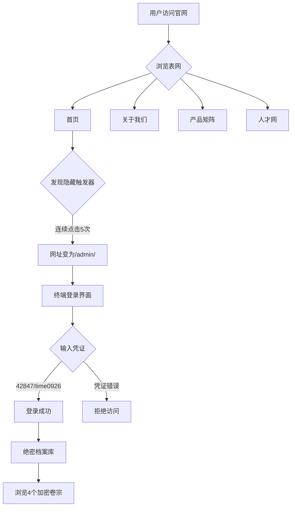

# 哈夫克集团官方网站 - 产品需求文档 (PRD)

## 1. 产品概述

哈夫克集团（Havoc Corporation）官方网站是《三角洲行动》游戏世界观中的虚构企业官网，采用双层架构设计：
- **表网（公关伪装）**：面向公众的极简主义科技巨头形象，展示"拯救世界"的正面形象
- **暗网（S10隐藏彩蛋）**：通过特定触发方式进入的内部系统，揭示哈夫克的真实野心与黑暗秘密

目标用户：游戏玩家、世界观探索者
核心价值：沉浸式体验哈夫克集团的世界观，通过互动叙事增强游戏代入感

## 2. 核心功能

### 2.1 用户角色
| 角色 | 访问方式 | 核心权限 |
|------|----------|----------|
| 普通访客 | 直接访问 | 浏览表网所有公开页面（首页、关于我们、产品、人才） |
| 内部管理员 | 触发隐藏入口 + 输入凭证 | 访问暗网绝密档案库 |

### 2.2 功能模块

#### 表网（公关伪装层）
1. **首页 (Home)**：Hero区域、CG短片《秩序之源》复刻、导航、Slogan
2. **关于我们 (About Us)**：集团愿景、起源历史、阿萨拉计划、焰火计划
3. **产品矩阵 (Products)**：4个核心产品的独立详情页
   - 曼德尔超算单元 (Mandel Brick)
   - 神经链接与脑机接口 (Project: Elysium)
   - 重型工程与战术外骨骼 (Titan Series)
   - 阿萨拉生态改造与能源矩阵 (Zero Dam Grid)
4. **人才网 (Careers)**：招聘海报、入职考试题

#### 暗网（S10彩蛋层）
5. **隐藏登录入口**：首页Logo右下角5次点击触发
6. **登录界面**：终端风格，账号42847/密码time0926
7. **绝密档案库**：4个加密卷宗
   - 人员事故伤亡调查
   - 哈夫克分部选址报告（员工日记）
   - 新科研基地实拍图（罗马大战场线索）
   - 脑机原型文件草稿

### 2.3 页面详情

| 页面名称 | 模块名称 | 功能描述 |
|----------|----------|----------|
| 首页 | Hero区域 | 全屏暗色背景，中央悬浮六边形Logo，鼠标滑动时背景闪过阿萨拉地图等高线与曼德尔砖代码流 |
| 首页 | CG短片播放器 | 点击播放按钮展开全屏CG《秩序之源》，包含5个分镜段落，配合大提琴与电子合成器音效 |
| 首页 | Slogan展示 | "Technology for a Better Tomorrow." 居中显示 |
| 首页 | 隐藏触发器 | Logo右下角阴影区域，连续点击5次触发暗网入口 |
| 首页 | 底部免责声明 | © 2035 Havoc Corporation 版权声明 |
| 关于我们 | 起源时间线 | 1993-2007年ERI组织创立到哈夫克集团成立的历史 |
| 关于我们 | 阿萨拉计划 | 2011年至今的零号大坝合作项目（美化版叙述） |
| 关于我们 | 焰火计划 | 2035年天网卫星损毁事件（包装为恐怖袭击） |
| 产品详情 | 曼德尔砖 | 超算能力展示，隐藏"人类意识上传协议"代码（需放大查看） |
| 产品详情 | 脑机接口 | 医疗康复案例展示，隐藏用户协议第402条（极小灰色字体） |
| 产品详情 | 外骨骼 | 3D模型展示，民用版与安保版对比，视频演示 |
| 产品详情 | 零号大坝 | 3D地形图，隐藏扎尔瓦特古城"生态退化"标记 |
| 人才网 | 招聘海报 | 阿萨拉新科研基地招聘，科幻风格 |
| 人才网 | 入职考试题 | 逻辑题 + 道德倾向测试题（3级辐射泄漏场景） |
| 暗网登录 | 终端界面 | 纯黑底绿代码风格，系统提示输入管理员凭证 |
| 暗网档案 | 卷宗列表 | 4个加密档案，需密钥访问，显示为粗糙内部数据库风格 |

## 3. 核心流程

### 表网浏览流程
用户访问官网 → 浏览首页（观看CG、了解Slogan）→ 点击导航进入"关于我们"了解历史 → 进入"产品矩阵"查看4个核心产品 → 进入"人才网"查看招聘信息

### 暗网触发流程
用户在首页 → 找到Logo右下角阴影区域 → 连续点击5次 → 网址自动变为 `/admin/` → 进入终端登录界面 → 输入账号42847/密码time0926 → 登录成功进入绝密档案库 → 浏览4个加密卷宗

## 4. 用户界面设计

### 4.1 设计风格
- **主色调**：深灰黑 (#0a0a0a, #1a1a1a) + 全息幽蓝 (#00d4ff, #0088cc)
- **辅助色**：警告红 (#ff0033) 用于暗网，成功绿 (#00ff41) 用于终端
- **字体**：无衬线字体（Orbitron用于标题，Rajdhani用于正文）
- **按钮风格**：扁平化 + 微光边框 + hover时发光效果
- **布局风格**：极简主义，大量留白，网格系统，卡片式产品展示
- **图标风格**：线性图标，细线条，科技感

### 4.2 页面设计概览

| 页面名称 | 模块名称 | UI元素 |
|----------|----------|--------|
| 首页 | Hero区域 | 全屏暗色背景，中央六边形Logo悬浮，鼠标视差效果，背景代码流动画 |
| 首页 | CG播放器 | 全屏视频播放器，播放按钮居中，进度条底部，时间戳显示 |
| 首页 | 导航栏 | 顶部固定，透明背景，hover时显示下划线，Logo左侧，菜单右侧 |
| 首页 | Slogan | 大号字体居中，字间距加大，渐变文字效果 |
| 首页 | 底部 | 深色背景，免责声明小字，社交图标，版权信息 |
| 关于我们 | 时间线 | 垂直时间线，左侧年份，右侧事件描述，节点圆点发光 |
| 关于我们 | 愿景卡片 | 半透明卡片，边框发光，图标+标题+描述 |
| 产品详情 | 产品卡片 | 3D透视效果，hover时翻转显示详情，背景渐变 |
| 产品详情 | 3D模型查看器 | Three.js渲染，鼠标拖拽旋转，缩放控制，光照效果 |
| 产品详情 | 隐藏细节 | 放大镜图标提示，点击放大显示隐藏代码/文字 |
| 人才网 | 招聘海报 | 科幻风格海报，全息投影效果，申请职位按钮 |
| 人才网 | 考试题 | 终端风格输入框，题目卡片，提交按钮 |
| 暗网登录 | 终端界面 | 纯黑背景，绿色等宽字体，闪烁光标，系统提示逐字显示 |
| 暗网档案 | 卷宗列表 | 粗糙数据库风格，文件图标，加密锁图标，点击展开详情 |
| 暗网档案 | 卷宗详情 | 打字机效果显示内容，红色警告标记，模糊图片 |

### 4.3 响应式设计
- **桌面端优先**：最小宽度1280px，最大宽度1920px居中
- **平板适配**：768px-1024px，导航转为汉堡菜单，卡片网格调整为2列
- **移动端适配**：375px-767px，单列布局，触摸优化，简化动画
- **交互优化**：移动端禁用鼠标视差，简化hover效果为tap效果

### 4.4 3D场景指导（如适用）
- **环境/HDRI**：暗色工业环境，低饱和度，冷色调
- **光照设置**：主光源为幽蓝色点光源，辅助光源为白色环境光，阴影柔和
- **摄像机设置**：透视摄像机，FOV 60度，缓慢环绕动画
- **构图与焦点**：产品居中，背景虚化，景深效果
- **交互与动画**：鼠标拖拽旋转，滚轮缩放，自动缓慢旋转
- **后处理效果**：泛光（Bloom）增强发光效果，色彩分级增强冷色调
- **资源来源与性能预算**：使用程序化生成的几何体，纹理压缩为KTX2格式，总资源<5MB

## 5. 技术约束

- **框架**：React 18 + TypeScript + Vite
- **样式**：Tailwind CSS 3 + CSS Modules（复杂动画）
- **3D渲染**：Three.js + @react-three/fiber + @react-three/drei
- **动画**：Framer Motion（页面过渡）+ CSS动画（微交互）
- **路由**：React Router v6
- **状态管理**：Zustand（暗网登录状态）
- **音效**：Web Audio API（CG短片背景音乐）
- **性能要求**：首屏加载<3s，60fps动画，Lighthouse评分>90
