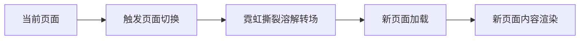
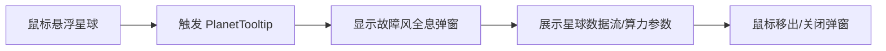

# 赛博朋克深空星系官网 - 产品需求文档

## 1. 产品概述

基于 Next.js 14 + TypeScript + Tailwind CSS + Framer Motion 构建的 4 页面赛博朋克深空星系官网，融合经典赛博朋克全套视觉特效，打造沉浸式星际数据可视化体验。

- **核心目的**：展示星际算力数据、星系轨道可视化、星际航道信息、星际资料档案
- **目标用户**：科技爱好者、数据可视化爱好者、赛博朋克文化受众
- **核心价值**：通过极致的视觉体验呈现深空星系数据，营造浩瀚宇宙与赛博科技融合的氛围

## 2. 核心功能模块

### 2.1 全局视觉规范

| 模块名称 | 功能描述 |
|---------|---------|
| 深空底层 | 漆黑宇宙底色，漫天闪烁星点粒子，叠加微弱数字网格纹理，远处星云混合洋红、电光青霓虹光晕 |
| GalaxyCanvas 星系画布 | 多层环形霓虹轨道循环自转，轨道带流动电光扫描光带，搭载赛博星球沿轨道环绕移动，支持拖拽缩放 |
| PlanetTooltip 星球交互 | 悬浮弹出故障风全息弹窗，文字像素闪烁，霓虹发光边框，展示星球数据流、星际算力参数 |
| HoloTimeBar 全息时间栏 | 金属镂空霓虹玻璃 UI，横向扫描霓虹光条，轻微文字 glitch 故障抖动，显示星际纪元、赛博时区、宇宙坐标 |
| 经典赛博特效 | 霓虹辉光、数字故障 glitch、电流流光扫描、粒子脉冲闪烁、金属磨损边框、细微雨水数据流粒子、底层电路板纹理 |
| 配色主调 | 深空黑、电光青 #00e5ff、洋红 #ff2b86、暗紫渐变，所有玻璃面板自带霓虹外发光 |
| 页面转场 | 霓虹撕裂溶解转场动画，全站统一赛博星空粒子背景 |
| 移动端适配 | 自动弱化故障特效，保留霓虹核心质感 |

### 2.2 页面详情

| 页面名称 | 路由 | 模块名称 | 功能描述 |
|---------|------|---------|---------|
| 首页 | / | 赛博星系总览 | 全屏巨型霓虹轨道星系画布，大小赛博星球环绕运转，顶部故障风全息时间栏，底部多层霓虹玻璃数据卡片 |
| 星体算力页 | /planets | 星体算力可视化 | 左侧小型交互星系画布，右侧巨型全息数据大屏，点击星球实时加载星球算力、数据流可视化图表，全屏流动数据光带 |
| 星际航道页 | /orbit | 星际航道可视化 | 多层扩张霓虹轨道可视化，轨道标注数字化航线参数，星球运转附带拖尾霓虹光轨，时间栏实时显示航道通行计时 |
| 星际资料库 | /archive | 星际档案时间轴 | 纵向电路板纹理时间轴，每个时间节点内嵌迷你动态星系窗口，滚动时依次点亮霓虹线条，故障文字渐显档案信息 |

### 2.3 复用交互组件

| 组件名称 | 功能描述 |
|---------|---------|
| CyberBackground | 赛博星空粒子背景，包含闪烁星点、数字网格、星云光晕 |
| GalaxyCanvas | 核心星系画布，多层环形轨道、赛博星球、拖拽缩放交互 |
| Planet | 赛博星球组件，电路纹理表面、脉冲霓虹明暗变化 |
| PlanetTooltip | 星球悬浮信息弹窗，故障风全息 UI |
| HoloTimeBar | 全息时间栏，显示星际纪元、赛博时区、宇宙坐标 |
| NeonGlassPanel | 霓虹玻璃面板，金属镂空边框、霓虹外发光 |
| GlitchText | 故障文字组件，像素闪烁效果 |
| DataFlowLine | 数据流光带，横向/纵向流动霓虹光条 |
| CyberGrid | 数字网格纹理叠加层 |
| ScanLine | 扫描光条，横向/纵向流动扫描效果 |

## 3. 核心流程

### 3.1 用户浏览流程

用户访问网站 → 首页展示巨型星系画布 → 点击导航切换页面 → 各页面展示对应数据可视化 → 悬浮星球查看详细信息 → 滚动/拖拽交互探索

### 3.2 页面切换流程

### 3.3 星球交互流程

## 4. 用户界面设计

### 4.1 设计风格

- **主色调**：深空黑 #000000、电光青 #00e5ff、洋红 #ff2b86、暗紫渐变 #1a0033 → #0a001a
- **霓虹辉光**：所有霓虹元素自带外发光效果，使用 box-shadow 和 filter: blur 实现
- **玻璃质感**：半透明玻璃面板，backdrop-filter: blur，霓虹边框
- **金属质感**：金属磨损边框，使用渐变和纹理模拟
- **字体**：使用等宽字体或科技感字体，标题使用粗体，正文使用细体
- **布局风格**：全屏沉浸式布局，多层空间纵深感，避免杂乱管道装饰
- **图标/装饰**：极简科技线条图标，避免过度装饰

### 4.2 页面设计概览

| 页面名称 | 模块名称 | UI 元素 |
|---------|---------|---------|
| 首页 | 星系画布 | 全屏 Canvas，多层环形轨道，霓虹描边，赛博星球环绕，底部数据卡片 |
| 首页 | 全息时间栏 | 顶部固定，金属玻璃 UI，扫描光条，glitch 文字 |
| 首页 | 数据卡片 | 多层霓虹玻璃卡片，展示关键数据指标 |
| 星体算力页 | 左侧画布 | 小型交互星系画布，点击星球触发数据加载 |
| 星体算力页 | 右侧数据屏 | 巨型全息数据大屏，算力图表，数据流可视化 |
| 星体算力页 | 数据光带 | 全屏流动数据光带，横向扫描效果 |
| 星际航道页 | 轨道可视化 | 多层扩张霓虹轨道，航线参数标注，拖尾光轨 |
| 星际航道页 | 航道计时 | 时间栏实时显示航道通行计时 |
| 星际资料库 | 时间轴 | 纵向电路板纹理时间轴，霓虹线条依次点亮 |
| 星际资料库 | 迷你星系窗口 | 每个时间节点内嵌迷你动态星系 |
| 星际资料库 | 档案信息 | 故障文字渐显档案信息 |

### 4.3 响应式设计

- **桌面端优先**：1920x1080 为基准设计
- **平板适配**：1024x768，调整布局比例，保留核心特效
- **移动端适配**：375x667，自动弱化故障特效（减少 glitch 频率、降低粒子数量），保留霓虹核心质感和核心交互
- **触摸优化**：移动端支持触摸拖拽画布、点击星球

### 4.4 特效实现指导

#### 4.4.1 星空粒子背景
- **实现方式**：使用 Canvas 2D 绘制粒子系统
- **粒子数量**：桌面端 200-300 个，移动端 50-100 个
- **闪烁效果**：随机透明度变化，周期 2-5 秒
- **星云光晕**：使用径向渐变，洋红和电光青混合

#### 4.4.2 GalaxyCanvas 星系画布
- **实现方式**：Canvas 2D 绘制多层环形轨道
- **轨道数量**：3-5 层，半径递增
- **轨道自转**：每层轨道独立旋转速度，使用 requestAnimationFrame
- **流动光带**：沿轨道圆周运动的渐变光带，使用 arc 和渐变填充
- **赛博星球**：圆形 + 电路纹理（使用线条绘制），脉冲霓虹效果
- **拖拽缩放**：监听鼠标/触摸事件，使用 transform 缩放和平移

#### 4.4.3 PlanetTooltip 全息弹窗
- **实现方式**：React 组件 + Framer Motion 动画
- **故障效果**：使用 CSS clip-path 和 transform 实现文字错位
- **霓虹边框**：box-shadow 多层叠加，外发光效果
- **像素闪烁**：opacity 随机变化，周期 0.1-0.3 秒

#### 4.4.4 HoloTimeBar 全息时间栏
- **实现方式**：固定定位 React 组件
- **金属质感**：使用线性渐变模拟金属反光
- **扫描光条**：横向移动的渐变光条，使用 CSS animation
- **glitch 抖动**：文字使用 transform: translate 随机偏移，周期 0.5-1 秒

#### 4.4.5 页面转场动画
- **实现方式**：Framer Motion AnimatePresence
- **撕裂效果**：使用 clip-path 或 mask 实现撕裂过渡
- **溶解效果**：使用 opacity 和 filter: blur 渐变

#### 4.4.6 电路板纹理
- **实现方式**：SVG 或 Canvas 绘制电路线条
- **应用场景**：背景叠加层、时间轴背景
- **透明度**：0.05-0.1，避免喧宾夺主

#### 4.4.7 数据流光带
- **实现方式**：CSS animation + 线性渐变
- **流动方向**：横向或纵向
- **速度**：2-5 秒完成一次流动

## 5. 音乐与音效（可选）

- **背景音乐**：环境电子音乐，低频脉冲，营造深空氛围
- **交互音效**：星球点击、页面切换时的轻微电子音效
- **音量控制**：提供静音/音量调节按钮

## 6. 性能优化

- **粒子系统**：使用 requestAnimationFrame，避免过度绘制
- **Canvas 优化**：离屏 Canvas 缓存静态元素
- **移动端降级**：减少粒子数量、降低特效复杂度
- **懒加载**：页面内容按需加载
- **图片优化**：使用 WebP 格式，懒加载图片

## 7. 技术约束

- **框架**：Next.js 14 (App Router)
- **语言**：TypeScript
- **样式**：Tailwind CSS
- **动画**：Framer Motion
- **浏览器支持**：Chrome 90+, Firefox 88+, Safari 14+, Edge 90+
- **无障碍**：基础键盘导航支持
