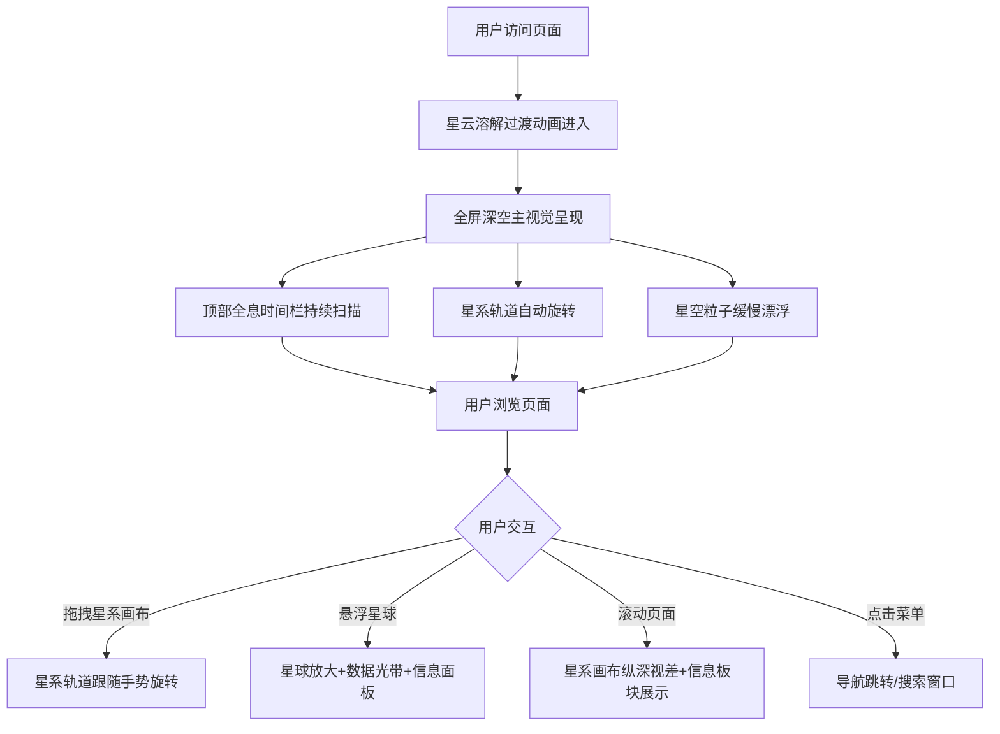

## 1. 产品概述

深空宇宙主题全屏动态官网，以浩瀚无垠的深空宇宙为视觉核心，打造极简未来科技风的沉浸式品牌展示页面。面向科技品牌、星际主题项目、科幻类产品发布等场景，通过星系轨道、星球交互、星空粒子等动效，营造静谧宏大、高级极简的星际科幻质感。

## 2. 核心功能

### 2.1 功能模块

1. **全息时间导航栏**：页面顶部固定通栏，半透明磨砂玻璃全息UI，实时展示星际纪元时间、宇宙坐标、时区数据，带扫描光带动效和数字滚动微动效。
2. **星空粒子背景**：全屏纯黑深空背景，铺满微弱星点粒子缓慢漂浮，远处朦胧星云渐变扩散收缩。
3. **星系轨道画布**：页面中央多层环形星系轨道缓慢自转，轨道带淡蓝色微弱流光描边，转速分层区分；支持鼠标拖拽拖动整个星系画布。
4. **星球交互系统**：轨道上分布多颗不同大小星球，自带缓慢自转和地表光影明暗变化；鼠标悬浮时星球放大、出现环绕数据光带和悬浮信息面板。
5. **深空玻璃信息板块**：下方多层深空玻璃信息卡片，展示星球数据、星际资讯、时空参数等内容。
6. **页面切换动效**：星云溶解过渡动画，淡入淡出丝滑无卡顿。

### 2.2 页面详情

| 页面名称 | 模块名称 | 功能描述 |
|---------|---------|---------|
| 首页 | 全息时间导航栏 | 固定顶部，展示星际纪元时间、宇宙坐标、时区，扫描光带动效，数字滚动微动效 |
| 首页 | 星空粒子背景 | 全屏纯黑深空，细碎星点粒子无规则漂浮，远处星云缓慢扩散收缩 |
| 首页 | 星系轨道画布 | 中央多层环形轨道自转，轨道流光流动，鼠标拖拽画布，视差纵深效果 |
| 首页 | 星球交互 | 多颗星球分布轨道上，自转+光影变化，悬浮放大+数据光带+信息面板 |
| 首页 | 深空玻璃信息板块 | 星球数据卡片、星际资讯卡片、时空参数卡片，玻璃拟态风格 |

## 3. 核心流程

## 4. 用户界面设计

### 4.1 设计风格

- **主色调**：深空黑 #000010、冰蓝 #4FC3F7、浅银灰 #B0BEC5、淡紫星云 #7C4DFF
- **材质质感**：低透明度深空玻璃拟态（backdrop-blur），细线条金属边框，轻微扫描流光动画，无厚重色块
- **字体**：标题使用 Orbitron（科技感未来字体），正文使用 Space Grotesk 或 Inter
- **布局风格**：全屏沉浸式单页布局，顶部固定导航栏，中央主视觉区域，下方信息板块
- **动效风格**：缓慢、丝滑、静谧，避免刺眼霓虹和赛博朋克风格

### 4.2 页面设计概览

| 页面名称 | 模块名称 | UI元素 |
|---------|---------|--------|
| 首页 | 全息时间导航栏 | 半透明磨砂玻璃底，微弱霓虹蓝光辉光，细线条边框，扫描光带流动，Orbitron字体数字 |
| 首页 | 星空粒子背景 | 纯黑深空 #000010，白色/淡蓝星点粒子，远处紫蓝星云渐变，无边界 |
| 首页 | 星系轨道画布 | 多层环形轨道，淡蓝流光描边，内层轨道转速快、外层慢，轨道透明细线 |
| 首页 | 星球 | 不同大小球体，地表纹理光影，引力光晕，悬浮放大+环绕数据光带 |
| 首页 | 信息板块 | 深空玻璃拟态卡片，低透明度背景，细金属边框，扫描流光，Icon+数据排版 |

### 4.3 响应式设计

- 桌面端优先设计，全屏星系轨道画布为视觉核心
- 移动端自动缩小星系轨道比例，简化粒子数量，保留全部核心动效
- 触摸设备支持手势拖拽星系画布
- 信息板块在移动端单列纵向排列

### 4.4 3D/动效场景指导

- 星系轨道：2D Canvas 或 CSS 3D Transform 实现多层环形轨道
- 星空粒子：Canvas 粒子系统，数千个粒子无规则缓慢漂浮
- 星球：CSS 3D 球体 + 光影动画，或使用 Canvas 绘制
- 相机/视角：固定视角，星系画布支持拖拽旋转
- 交互：鼠标拖拽旋转画布，悬浮星球触发放大动画
- 性能：移动端降低粒子数量至 1/3，使用 requestAnimationFrame 优化