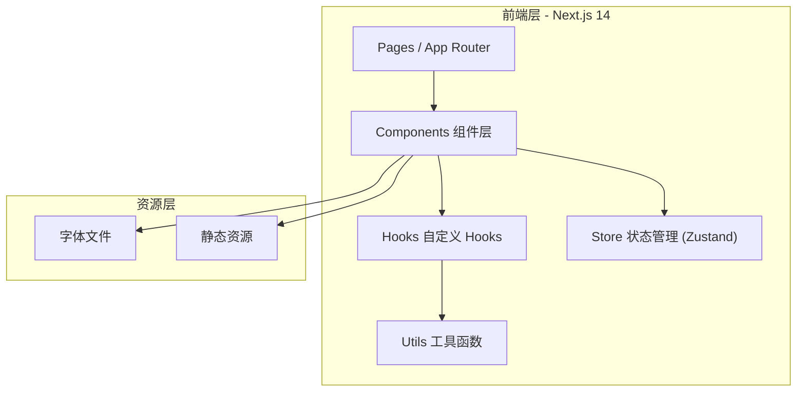

## 1. 架构设计



## 2. 技术描述

- **前端框架**：Next.js 14 + React 18 + TypeScript
- **样式方案**：Tailwind CSS 3
- **动效库**：Framer Motion
- **状态管理**：Zustand
- **图标库**：lucide-react
- **字体**：Orbitron（Google Fonts）+ Space Grotesk（Google Fonts）
- **初始化工具**：Next.js create-next-app
- **后端**：无（纯前端项目）

## 3. 路由定义

| 路由 | 用途 |
|------|------|
| / | 首页 - 深空宇宙主题全屏动态官网 |

## 4. 组件架构

```
src/
├── app/
│   ├── layout.tsx          # 根布局
│   ├── page.tsx            # 首页
│   └── globals.css         # 全局样式
├── components/
│   ├── StarfieldBackground.tsx   # 星空粒子背景
│   ├── GalaxyCanvas.tsx          # 星系轨道画布（核心）
│   ├── Planet.tsx                # 单个星球组件
│   ├── PlanetTooltip.tsx         # 星球悬浮信息面板
│   ├── HoloTimeBar.tsx           # 顶部全息时间导航栏
│   ├── HolographicSearch.tsx     # 全息搜索窗口
│   ├── GlassInfoCard.tsx         # 深空玻璃信息卡片
│   ├── InfoSection.tsx           # 底部信息板块容器
│   └── PageTransition.tsx        # 页面过渡动画
├── hooks/
│   ├── useStarfield.ts           # 星空粒子逻辑
│   ├── useGalaxyDrag.ts          # 星系拖拽逻辑
│   └── useTimeData.ts            # 时间数据实时更新
├── store/
│   └── useGalaxyStore.ts         # 星系状态管理
└── utils/
    └── planetData.ts             # 星球模拟数据
```

## 5. 数据模型

### 5.1 星球数据定义

```typescript
interface PlanetData {
  id: string;
  name: string;
  type: 'terrestrial' | 'gas-giant' | 'ice' | 'dwarf';
  orbitRadius: number;      // 轨道半径 (px)
  size: number;              // 星球大小 (px)
  orbitSpeed: number;        // 轨道转速 (rad/s)
  rotationSpeed: number;     // 自转速度
  color: string;             // 主色调
  glowColor: string;         // 光晕颜色
  angle: number;             // 初始角度
  info: {
    diameter: string;
    temperature: string;
    gravity: string;
    description: string;
  };
}
```

### 5.2 时间数据定义

```typescript
interface TimeData {
  starDate: string;          // 星际纪元时间
  cosmicCoordinate: string;  // 宇宙坐标
  timezone: string;          // 时区
  localTime: string;         // 本地时间
}
```

### 5.3 星系状态

```typescript
interface GalaxyState {
  rotation: { x: number; y: number };  // 星系旋转角度
  zoom: number;                         // 缩放级别
  hoveredPlanet: string | null;         // 悬浮星球ID
  isDragging: boolean;                  // 是否拖拽中
  dragStart: { x: number; y: number };  // 拖拽起始点
}
```