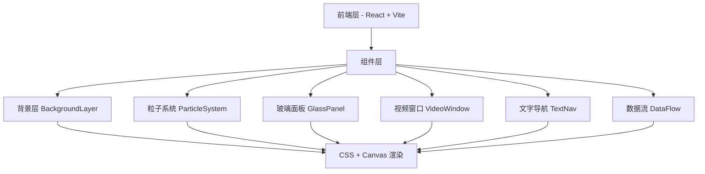

## 1. 架构设计



## 2. 技术描述

- **前端**：React@18 + TypeScript + TailwindCSS@3 + Vite
- **初始化工具**：vite-init (react-ts 模板)
- **状态管理**：zustand
- **图标**：lucide-react
- **后端**：无 (纯前端项目)
- **动画**：CSS Animations + Canvas 2D

## 3. 路由定义

| 路由 | 用途 |
|-------|---------|
| / | 首页 - 全屏AI品牌官网首页 |

## 4. 组件结构

```
src/
├── components/
│   ├── BackgroundLayer.tsx    # 背景层：景深模糊背景、量子服务器、镜面地面
│   ├── ParticleSystem.tsx     # 粒子系统：Canvas粒子动画、漂浮光点
│   ├── GlassPanel.tsx         # 玻璃面板：悬浮透明玻璃层
│   ├── VideoWindow.tsx        # 视频窗口：全息悬浮视频
│   ├── DataFlow.tsx           # 数据流：水平流动数据线
│   ├── TextNav.tsx            # 文字导航：全息发光字体
│   └── NoiseOverlay.tsx       # 噪点叠加层：胶片质感
├── pages/
│   └── Home.tsx               # 首页主组件
├── hooks/
│   └── useAnimation.ts        # 动画控制hooks
├── App.tsx
└── main.tsx
```

## 5. 数据模型

无后端，纯前端展示页面，无需数据模型。

## 6. 性能策略

- Canvas粒子系统使用 requestAnimationFrame 优化
- CSS动画使用 transform 和 opacity 启用以GPU加速
- 视频窗口使用占位动画模拟（避免真实视频加载性能问题）
- 所有动态元素使用 will-change 和 transform: translateZ(0) 开启硬件加速