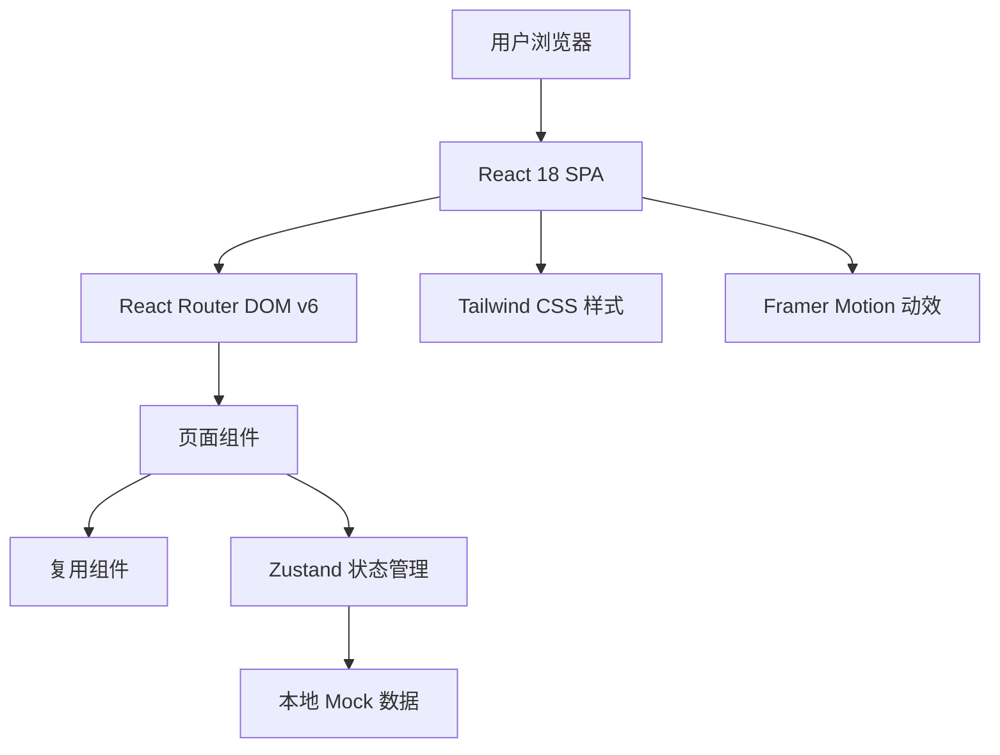
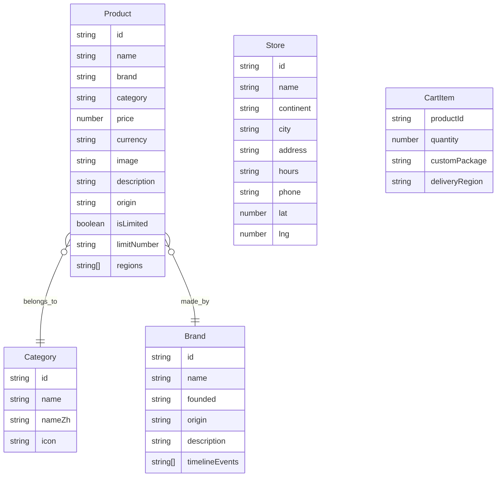

## 1. 架构设计



## 2. 技术说明

- 前端：React 18 + TypeScript + Vite
- 初始化工具：vite-init（react-ts 模板）
- 状态管理：Zustand
- 路由：React Router DOM v6
- 样式：Tailwind CSS 3
- 动效：Framer Motion
- 图标：Lucide React
- 后端：无（纯前端项目，使用 Mock 数据）
- 字体：Google Fonts（Cormorant Garamond、JetBrains Mono）

## 3. 路由定义

| 路由 | 页面 | 说明 |
|------|------|------|
| `/` | 首页 | 全球奢品总览主页 |
| `/shop` | 全品类商品列表页 | 左侧分类 + 右侧网格 |
| `/product/:id` | 单品详情页 | 360° 预览 + 全球售价 |
| `/cart` | 购物车结算页 | 订单面板 + 结算表单 |
| `/stores` | 全球线下门店页 | 交互式世界地图 |
| `/archive` | 品牌典藏档案页 | 金属时间轴 |

## 4. 数据模型

### 4.1 核心实体



### 4.2 数据定义

Mock 数据以 TypeScript 模块形式内嵌于项目中，类型定义：

```typescript
interface Product {
  id: string;
  name: string;
  brand: string;
  category: string;
  price: number;
  currency: string;
  images: string[];
  description: string;
  origin: string;
  isLimited: boolean;
  limitNumber?: string;
  regions: string[];
  customService: string[];
}

interface Category {
  id: string;
  name: string;
  nameZh: string;
  icon: string;
}

interface Store {
  id: string;
  name: string;
  continent: string;
  city: string;
  address: string;
  hours: string;
  phone: string;
  lat: number;
  lng: number;
}

interface CartItem {
  productId: string;
  quantity: number;
  customPackage: string;
  deliveryRegion: string;
}

interface Brand {
  id: string;
  name: string;
  founded: string;
  origin: string;
  description: string;
  timelineEvents: TimelineEvent[];
}

interface TimelineEvent {
  year: string;
  title: string;
  description: string;
  productId?: string;
}
```

## 5. 组件树

```
App
├── HoloGlobalNav (全局导航栏)
│   ├── Logo
│   ├── RegionSelector
│   ├── CurrencySelector
│   ├── CategoryMenu
│   ├── CartIcon
│   └── UserIcon
├── Routes
│   ├── HomePage
│   │   ├── HeroCarousel (主视觉轮播)
│   │   ├── LimitedNewArrivals (限定新品)
│   │   ├── FlagshipSeries (旗舰系列)
│   │   ├── StoreMapPreview (门店地图入口)
│   │   └── BrandStory (集团品牌故事)
│   ├── ShopPage
│   │   ├── CategorySidebar (分类侧边栏)
│   │   ├── FilterBar (筛选栏)
│   │   └── ProductGrid (商品网格)
│   │       └── LuxuryProductCard (商品卡片)
│   ├── ProductDetailPage
│   │   ├── Product360Viewer (360° 预览)
│   │   ├── ProductInfoPanel (信息面板)
│   │   └── BrandStoreMap (品牌专柜分布)
│   ├── CartPage
│   │   ├── CheckoutGlassPanel (结算玻璃面板)
│   │   └── DeliveryForm (配送表单)
│   ├── StoresPage
│   │   ├── WorldMapCanvas (全球门店地图)
│   │   └── StoreModal (门店弹窗)
│   └── ArchivePage
│       └── ArchiveTimeline (典藏时间轴)
├── Footer
└── PageTransition (页面过渡动画)
```

## 6. 项目文件结构

```
src/
├── components/
│   ├── global/
│   │   ├── HoloGlobalNav.tsx
│   │   ├── Footer.tsx
│   │   └── PageTransition.tsx
│   ├── home/
│   │   ├── HeroCarousel.tsx
│   │   ├── LimitedNewArrivals.tsx
│   │   ├── FlagshipSeries.tsx
│   │   ├── StoreMapPreview.tsx
│   │   └── BrandStory.tsx
│   ├── shop/
│   │   ├── CategorySidebar.tsx
│   │   ├── FilterBar.tsx
│   │   ├── ProductGrid.tsx
│   │   └── LuxuryProductCard.tsx
│   ├── product/
│   │   ├── Product360Viewer.tsx
│   │   ├── ProductInfoPanel.tsx
│   │   └── BrandStoreMap.tsx
│   ├── cart/
│   │   ├── CheckoutGlassPanel.tsx
│   │   ├── CartItemRow.tsx
│   │   └── DeliveryForm.tsx
│   ├── stores/
│   │   ├── WorldMapCanvas.tsx
│   │   └── StoreModal.tsx
│   └── archive/
│       └── ArchiveTimeline.tsx
├── pages/
│   ├── HomePage.tsx
│   ├── ShopPage.tsx
│   ├── ProductDetailPage.tsx
│   ├── CartPage.tsx
│   ├── StoresPage.tsx
│   └── ArchivePage.tsx
├── hooks/
│   ├── useScrollNav.ts
│   └── useGlobalScanLine.ts
├── store/
│   ├── useCartStore.ts
│   ├── useCurrencyStore.ts
│   └── useRegionStore.ts
├── data/
│   ├── products.ts
│   ├── categories.ts
│   ├── stores.ts
│   ├── brands.ts
│   └── currencies.ts
├── types/
│   └── index.ts
├── utils/
│   └── format.ts
├── App.tsx
├── main.tsx
└── index.css
```