# 赛博朋克深空星系官网 - 技术架构文档

## 1. 架构设计

```mermaid
graph TB
    subgraph "前端层"
        A[Next.js 14 App Router]
        A --> B[页面组件 Pages]
        A --> C[布局组件 Layout]
        A --> D[复用组件 Components]
        B --> E[首页 /]
        B --> F[星体算力页 /planets]
        B --> G[星际航道页 /orbit]
        B --> H[星际资料库 /archive]
        C --> I[全局布局 RootLayout]
        C --> J[导航组件 Navigation]
        D --> K[GalaxyCanvas 星系画布]
        D --> L[Planet 赛博星球]
        D --> M[PlanetTooltip 全息弹窗]
        D --> N[HoloTimeBar 全息时间栏]
        D --> O[CyberBackground 星空背景]
        D --> P[NeonGlassPanel 霓虹玻璃面板]
        D --> Q[GlitchText 故障文字]
        D --> R[DataFlowLine 数据光带]
    end
    
    subgraph "状态管理层"
        S1[Zustand Store]
        S1 --> S2[galaxyStore 星系状态]
        S1 --> S3[uiStore UI状态]
        S1 --> S4[dataStore 数据状态]
    end
    
    subgraph "样式层"
        T1[Tailwind CSS]
        T2[全局 CSS 变量]
        T3[动画关键帧]
        T1 --> T4[赛博朋克主题配置]
    end
    
    subgraph "工具层"
        U1[Canvas 绘制工具]
        U2[动画工具函数]
        U3[数据模拟生成器]
    end
    
    B --> S1
    D --> S1
    D --> T1
    D --> U1
    D --> U2
    B --> U3
```



## 2. 技术说明

### 2.1 前端技术栈

| 技术 | 版本 | 用途 |
|-----|------|------|
| Next.js | 14.x | React 框架，App Router 路由系统 |
| TypeScript | 5.x | 类型安全 |
| React | 18.x | UI 组件库 |
| Tailwind CSS | 3.x | 原子化 CSS 框架 |
| Framer Motion | 10.x | 动画库，页面转场、组件动画 |
| Zustand | 4.x | 轻量级状态管理 |
| Canvas 2D API | 原生 | 星系画布、粒子系统绘制 |

### 2.2 项目初始化工具

- **初始化命令**：`npx create-next-app@latest . --typescript --tailwind --app --no-src-dir --import-alias "@/*"`
- **包管理器**：npm（Next.js 默认）

### 2.3 浏览器兼容性

- Chrome 90+
- Firefox 88+
- Safari 14+
- Edge 90+

## 3. 路由定义

| 路由 | 页面名称 | 功能描述 |
|------|---------|---------|
| / | 首页 | 赛博星系总览，全屏星系画布，全息时间栏，数据卡片 |
| /planets | 星体算力页 | 左侧小型星系画布，右侧全息数据大屏，算力可视化 |
| /orbit | 星际航道页 | 多层扩张霓虹轨道，航线参数标注，拖尾光轨，航道计时 |
| /archive | 星际资料库 | 纵向电路板纹理时间轴，迷你星系窗口，档案信息 |

### 3.1 路由文件结构

```
app/
├── layout.tsx              # 全局布局，包含 CyberBackground、Navigation
├── page.tsx                # 首页
├── planets/
│   └── page.tsx            # 星体算力页
├── orbit/
│   └── page.tsx            # 星际航道页
└── archive/
    └── page.tsx            # 星际资料库
```

## 4. 组件架构

### 4.1 组件分层

```
components/
├── core/                   # 核心组件
│   ├── GalaxyCanvas.tsx    # 星系画布（核心交互组件）
│   ├── Planet.tsx          # 赛博星球
│   └── PlanetTooltip.tsx   # 星球全息弹窗
├── layout/                 # 布局组件
│   ├── RootLayout.tsx      # 全局布局容器
│   ├── Navigation.tsx      # 导航组件
│   └── HoloTimeBar.tsx     # 全息时间栏
├── ui/                     # UI 组件
│   ├── CyberBackground.tsx # 赛博星空背景
│   ├── NeonGlassPanel.tsx  # 霓虹玻璃面板
│   ├── GlitchText.tsx      # 故障文字
│   ├── DataFlowLine.tsx    # 数据光带
│   ├── CyberGrid.tsx       # 数字网格
│   └── ScanLine.tsx        # 扫描光条
└── shared/                 # 共享小组件
    ├── NeonButton.tsx      # 霓虹按钮
    └── HoloCard.tsx        # 全息卡片
```

### 4.2 核心组件说明

#### 4.2.1 GalaxyCanvas 星系画布

**职责**：
- 绘制多层环形霓虹轨道
- 渲染赛博星球沿轨道运动
- 实现流动电光扫描光带
- 支持拖拽、缩放交互

**Props 接口**：
```typescript
interface GalaxyCanvasProps {
  width?: number;
  height?: number;
  orbits?: number;           // 轨道层数，默认 3-5
  planets?: PlanetData[];    // 星球数据
  interactive?: boolean;     // 是否支持交互，默认 true
  className?: string;
}

interface PlanetData {
  id: string;
  name: string;
  orbitIndex: number;        // 所在轨道层级
  radius: number;            // 星球半径
  color: string;             // 主色调
  angle: number;             // 初始角度
  speed: number;             // 公转速度
  data?: {
    computingPower: number;  // 算力
    dataFlow: number;        // 数据流
    coordinates: string;     // 坐标
  };
}
```

**实现要点**：
- 使用 Canvas 2D API 绘制
- requestAnimationFrame 驱动动画循环
- 离屏 Canvas 缓存静态轨道
- 鼠标/触摸事件处理拖拽缩放
- 星球位置计算：`x = centerX + radius * cos(angle)`, `y = centerY + radius * sin(angle)`

#### 4.2.2 Planet 赛博星球

**职责**：
- 绘制星球外观（电路纹理、脉冲霓虹）
- 响应悬浮事件触发 Tooltip
- 沿轨道运动动画

**Props 接口**：
```typescript
interface PlanetProps {
  data: PlanetData;
  position: { x: number; y: number };
  onHover?: (data: PlanetData) => void;
  onLeave?: () => void;
  onClick?: (data: PlanetData) => void;
}
```

**实现要点**：
- Canvas 绘制圆形 + 电路纹理（线条）
- 脉冲效果：opacity 周期性变化
- 悬浮检测：鼠标位置与星球中心距离 < radius

#### 4.2.3 PlanetTooltip 全息弹窗

**职责**：
- 显示星球详细信息
- 故障风全息 UI 效果
- 霓虹发光边框

**Props 接口**：
```typescript
interface PlanetTooltipProps {
  data: PlanetData;
  position: { x: number; y: number };
  visible: boolean;
}
```

**实现要点**：
- React 组件，绝对定位
- Framer Motion 入场/出场动画
- CSS glitch 效果（clip-path + transform）
- 霓虹边框：box-shadow 多层叠加

#### 4.2.4 HoloTimeBar 全息时间栏

**职责**：
- 显示星际纪元、赛博时区、宇宙坐标
- 金属镂空霓虹玻璃 UI
- 横向扫描霓虹光条
- 文字 glitch 故障抖动

**Props 接口**：
```typescript
interface HoloTimeBarProps {
  className?: string;
}
```

**实现要点**：
- 固定定位在顶部
- 金属质感：linear-gradient 模拟
- 扫描光条：CSS animation 横向移动
- glitch 效果：伪元素 + transform 随机偏移
- 时间更新：setInterval 每秒更新

#### 4.2.5 CyberBackground 赛博星空背景

**职责**：
- 绘制闪烁星点粒子
- 绘制数字网格纹理
- 绘制远处星云光晕

**Props 接口**：
```typescript
interface CyberBackgroundProps {
  particleCount?: number;    // 粒子数量，默认 200
  className?: string;
}
```

**实现要点**：
- Canvas 2D 粒子系统
- 粒子闪烁：opacity 随机变化
- 星云光晕：径向渐变
- 数字网格：线条绘制，透明度 0.05-0.1
- 移动端降级：减少粒子数量

### 4.3 UI 组件说明

#### 4.3.1 NeonGlassPanel 霓虹玻璃面板

**职责**：
- 半透明玻璃面板
- 霓虹发光边框
- 金属磨损质感

**Props 接口**：
```typescript
interface NeonGlassPanelProps {
  children: React.ReactNode;
  glowColor?: string;        // 霓虹颜色，默认 #00e5ff
  className?: string;
}
```

**实现要点**：
- backdrop-filter: blur(10px)
- 霓虹边框：box-shadow 多层
- 金属质感：border 渐变

#### 4.3.2 GlitchText 故障文字

**职责**：
- 文字像素闪烁效果
- glitch 故障抖动

**Props 接口**：
```typescript
interface GlitchTextProps {
  children: React.ReactNode;
  intensity?: 'low' | 'medium' | 'high';
  className?: string;
}
```

**实现要点**：
- CSS animation + clip-path
- 伪元素 ::before/::after 错位
- 透明度随机变化

#### 4.3.3 DataFlowLine 数据光带

**职责**：
- 横向/纵向流动霓虹光条
- 数据流视觉效果

**Props 接口**：
```typescript
interface DataFlowLineProps {
  direction?: 'horizontal' | 'vertical';
  color?: string;
  speed?: number;            // 流动速度，秒
  className?: string;
}
```

**实现要点**：
- CSS animation + linear-gradient
- 背景位置移动实现流动效果

## 5. 状态管理

### 5.1 Zustand Store 结构

```typescript
// store/galaxyStore.ts
interface GalaxyState {
  planets: PlanetData[];
  selectedPlanet: PlanetData | null;
  hoveredPlanet: PlanetData | null;
  canvasTransform: {
    scale: number;
    offsetX: number;
    offsetY: number;
  };
  
  // Actions
  setPlanets: (planets: PlanetData[]) => void;
  selectPlanet: (planet: PlanetData | null) => void;
  hoverPlanet: (planet: PlanetData | null) => void;
  updateCanvasTransform: (transform: Partial<GalaxyState['canvasTransform']>) => void;
}

// store/uiStore.ts
interface UIState {
  isMobile: boolean;
  isMusicEnabled: boolean;
  currentPage: string;
  
  // Actions
  setIsMobile: (isMobile: boolean) => void;
  toggleMusic: () => void;
  setCurrentPage: (page: string) => void;
}

// store/dataStore.ts
interface DataState {
  computingData: ComputingData[];
  orbitData: OrbitData[];
  archiveData: ArchiveData[];
  
  // Actions
  fetchComputingData: () => Promise<void>;
  fetchOrbitData: () => Promise<void>;
  fetchArchiveData: () => Promise<void>;
}
```

### 5.2 数据模拟生成

由于项目无后端，使用模拟数据：

```typescript
// utils/mockData.ts
export function generatePlanets(): PlanetData[] {
  // 生成 8-12 个星球数据
}

export function generateComputingData(): ComputingData[] {
  // 生成算力数据
}

export function generateOrbitData(): OrbitData[] {
  // 生成航道数据
}

export function generateArchiveData(): ArchiveData[] {
  // 生成档案数据
}
```

## 6. 样式系统

### 6.1 Tailwind 配置

```javascript
// tailwind.config.js
module.exports = {
  theme: {
    extend: {
      colors: {
        'cyber-black': '#000000',
        'cyber-cyan': '#00e5ff',
        'cyber-magenta': '#ff2b86',
        'cyber-purple-dark': '#1a0033',
        'cyber-purple-deep': '#0a001a',
      },
      animation: {
        'glitch': 'glitch 0.3s infinite',
        'scan': 'scan 2s linear infinite',
        'pulse-neon': 'pulse-neon 2s ease-in-out infinite',
        'flow': 'flow 3s linear infinite',
      },
      keyframes: {
        glitch: {
          '0%, 100%': { transform: 'translate(0)' },
          '20%': { transform: 'translate(-2px, 2px)' },
          '40%': { transform: 'translate(-2px, -2px)' },
          '60%': { transform: 'translate(2px, 2px)' },
          '80%': { transform: 'translate(2px, -2px)' },
        },
        scan: {
          '0%': { transform: 'translateX(-100%)' },
          '100%': { transform: 'translateX(100%)' },
        },
        'pulse-neon': {
          '0%, 100%': { opacity: '1' },
          '50%': { opacity: '0.5' },
        },
        flow: {
          '0%': { backgroundPosition: '0% 50%' },
          '100%': { backgroundPosition: '200% 50%' },
        },
      },
      boxShadow: {
        'neon-cyan': '0 0 10px #00e5ff, 0 0 20px #00e5ff, 0 0 30px #00e5ff',
        'neon-magenta': '0 0 10px #ff2b86, 0 0 20px #ff2b86, 0 0 30px #ff2b86',
      },
    },
  },
};
```

### 6.2 全局 CSS 变量

```css
/* app/globals.css */
:root {
  --cyber-black: #000000;
  --cyber-cyan: #00e5ff;
  --cyber-magenta: #ff2b86;
  --cyber-purple-dark: #1a0033;
  --cyber-purple-deep: #0a001a;
  
  --neon-glow-cyan: 0 0 10px var(--cyber-cyan), 0 0 20px var(--cyber-cyan), 0 0 30px var(--cyber-cyan);
  --neon-glow-magenta: 0 0 10px var(--cyber-magenta), 0 0 20px var(--cyber-magenta), 0 0 30px var(--cyber-magenta);
  
  --glass-bg: rgba(10, 0, 26, 0.5);
  --glass-border: rgba(0, 229, 255, 0.3);
}
```

### 6.3 通用样式类

```css
/* 霓虹玻璃面板 */
.neon-glass {
  background: var(--glass-bg);
  backdrop-filter: blur(10px);
  border: 1px solid var(--glass-border);
  box-shadow: var(--neon-glow-cyan);
}

/* 故障文字 */
.glitch-text {
  position: relative;
  animation: glitch 0.3s infinite;
}

.glitch-text::before,
.glitch-text::after {
  content: attr(data-text);
  position: absolute;
  top: 0;
  left: 0;
  width: 100%;
  height: 100%;
}

.glitch-text::before {
  left: 2px;
  text-shadow: -2px 0 var(--cyber-magenta);
  clip: rect(44, 450, 56, 0);
  animation: glitch-anim 5s infinite;
}

.glitch-text::after {
  left: -2px;
  text-shadow: -2px 0 var(--cyber-cyan);
  clip: rect(44, 450, 56, 0);
  animation: glitch-anim2 5s infinite;
}

/* 扫描光条 */
.scan-line {
  position: absolute;
  width: 100%;
  height: 2px;
  background: linear-gradient(90deg, transparent, var(--cyber-cyan), transparent);
  animation: scan 2s linear infinite;
}

/* 数据流光带 */
.data-flow {
  background: linear-gradient(90deg, transparent, var(--cyber-cyan), transparent);
  background-size: 200% 100%;
  animation: flow 3s linear infinite;
}
```

## 7. 页面转场动画

### 7.1 实现方式

使用 Framer Motion 的 AnimatePresence 实现页面转场：

```typescript
// components/layout/PageTransition.tsx
import { motion, AnimatePresence } from 'framer-motion';
import { usePathname } from 'next/navigation';

export function PageTransition({ children }: { children: React.ReactNode }) {
  const pathname = usePathname();
  
  return (
    <AnimatePresence mode="wait">
      <motion.div
        key={pathname}
        initial={{ opacity: 0, filter: 'blur(10px)' }}
        animate={{ opacity: 1, filter: 'blur(0px)' }}
        exit={{ opacity: 0, filter: 'blur(10px)' }}
        transition={{ duration: 0.5 }}
      >
        {children}
      </motion.div>
    </AnimatePresence>
  );
}
```

### 7.2 霓虹撕裂效果

通过 clip-path 实现撕裂过渡：

```typescript
const tearVariants = {
  initial: { clipPath: 'polygon(0 0, 100% 0, 100% 100%, 0 100%)' },
  animate: { clipPath: 'polygon(0 0, 100% 0, 100% 100%, 0 100%)' },
  exit: { 
    clipPath: 'polygon(0 0, 100% 0, 90% 100%, 10% 100%)',
    transition: { duration: 0.5 }
  },
};
```

## 8. 性能优化策略

### 8.1 Canvas 优化

- **离屏 Canvas**：缓存静态轨道绘制，避免每帧重绘
- **requestAnimationFrame**：统一动画循环，避免多个定时器
- **粒子系统**：限制粒子数量，移动端降级
- **视口裁剪**：只绘制视口内的元素

### 8.2 React 优化

- **React.memo**：包裹纯组件，避免不必要的重渲染
- **useMemo**：缓存复杂计算结果
- **useCallback**：缓存回调函数
- **代码分割**：使用 next/dynamic 懒加载非关键组件

### 8.3 移动端降级

```typescript
// hooks/useDeviceDetection.ts
export function useDeviceDetection() {
  const [isMobile, setIsMobile] = useState(false);
  
  useEffect(() => {
    const checkMobile = () => {
      setIsMobile(window.innerWidth < 768);
    };
    checkMobile();
    window.addEventListener('resize', checkMobile);
    return () => window.removeEventListener('resize', checkMobile);
  }, []);
  
  return isMobile;
}
```

**降级策略**：
- 粒子数量：桌面端 200-300，移动端 50-100
- glitch 效果频率：桌面端正常，移动端降低 50%
- Canvas 分辨率：移动端降低 0.5x
- 动画复杂度：移动端简化部分特效

## 9. 文件结构

```
/workspace/
├── app/
│   ├── layout.tsx              # 全局布局
│   ├── page.tsx                # 首页
│   ├── planets/
│   │   └── page.tsx            # 星体算力页
│   ├── orbit/
│   │   └── page.tsx            # 星际航道页
│   ├── archive/
│   │   └── page.tsx            # 星际资料库
│   └── globals.css             # 全局样式
├── components/
│   ├── core/
│   │   ├── GalaxyCanvas.tsx
│   │   ├── Planet.tsx
│   │   └── PlanetTooltip.tsx
│   ├── layout/
│   │   ├── RootLayout.tsx
│   │   ├── Navigation.tsx
│   │   ├── HoloTimeBar.tsx
│   │   └── PageTransition.tsx
│   ├── ui/
│   │   ├── CyberBackground.tsx
│   │   ├── NeonGlassPanel.tsx
│   │   ├── GlitchText.tsx
│   │   ├── DataFlowLine.tsx
│   │   ├── CyberGrid.tsx
│   │   └── ScanLine.tsx
│   └── shared/
│       ├── NeonButton.tsx
│       └── HoloCard.tsx
├── store/
│   ├── galaxyStore.ts
│   ├── uiStore.ts
│   └── dataStore.ts
├── hooks/
│   ├── useDeviceDetection.ts
│   ├── useCanvasAnimation.ts
│   └── usePlanetInteraction.ts
├── utils/
│   ├── mockData.ts
│   ├── canvasHelpers.ts
│   └── animationHelpers.ts
├── types/
│   └── index.ts                # 类型定义
├── public/
│   └── audio/                  # 音频文件（可选）
├── tailwind.config.js
├── tsconfig.json
└── package.json
```

## 10. 开发计划

### 阶段 1：项目初始化与基础架构
- 初始化 Next.js 项目
- 配置 Tailwind CSS 主题
- 创建全局样式和 CSS 变量
- 搭建基础布局结构

### 阶段 2：核心组件开发
- 实现 CyberBackground 星空背景
- 实现 GalaxyCanvas 星系画布
- 实现 Planet 和 PlanetTooltip
- 实现 HoloTimeBar 全息时间栏

### 阶段 3：UI 组件开发
- 实现 NeonGlassPanel
- 实现 GlitchText
- 实现 DataFlowLine
- 实现其他辅助组件

### 阶段 4：页面实现
- 实现首页
- 实现星体算力页
- 实现星际航道页
- 实现星际资料库

### 阶段 5：动画与交互
- 实现页面转场动画
- 优化星球交互
- 添加音效（可选）

### 阶段 6：性能优化与测试
- 移动端适配与降级
- 性能优化
- 跨浏览器测试

## 11. 技术约束与注意事项

1. **Canvas 性能**：避免过度绘制，使用离屏 Canvas 缓存静态元素
2. **动画流畅度**：使用 requestAnimationFrame，避免 setInterval 驱动动画
3. **内存管理**：组件卸载时清理定时器和事件监听器
4. **类型安全**：所有组件和函数使用 TypeScript 严格类型
5. **代码质量**：组件保持单一职责，避免超过 300 行
6. **可访问性**：提供键盘导航支持，避免纯视觉交互
7. **浏览器兼容**：测试主流浏览器，提供降级方案
