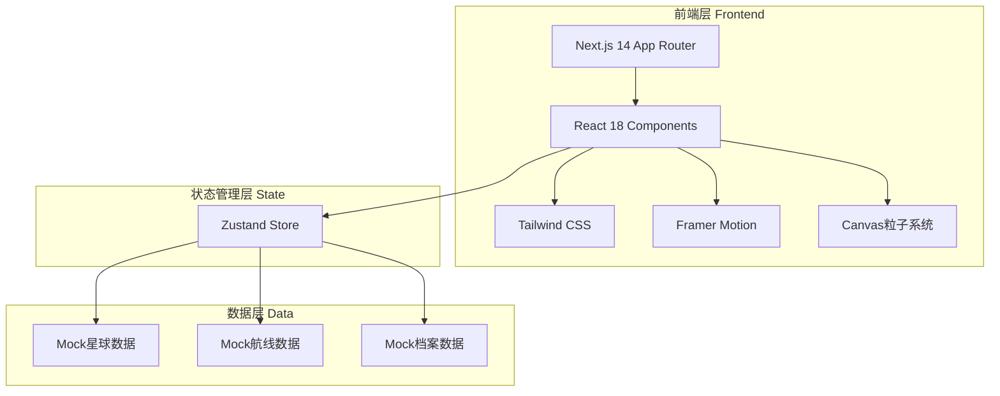

# 深空宇宙主题官网技术架构文档

## 1. 架构设计



## 2. 技术说明

- **前端框架**：Next.js 14 (App Router) + React 18 + TypeScript
- **样式方案**：Tailwind CSS 3 + CSS变量主题系统
- **动效引擎**：Framer Motion（页面过渡、悬浮交互、数字滚动）
- **粒子系统**：原生Canvas API（星尘粒子、星云背景）
- **状态管理**：Zustand（全局星系状态、画布变换、选中星球）
- **字体方案**：Orbitron（标题）+ Rajdhani（正文）+ Share Tech Mono（数据）
- **图标库**：Lucide React
- **后端**：无，纯前端静态站点，Mock数据

## 3. 路由定义

| 路由 | 页面 | 说明 |
|------|------|------|
| / | 首页 - 星际总览页 | 全屏星系画布，底部信息板块 |
| /planets | 星体数据页 | 左侧星系预览，右侧全息数据面板 |
| /orbit | 星际航线页 | 扩张式环形轨道可视化 |
| /archive | 时空档案页 | 纵向滚动玻璃时间轴 |

## 4. 项目文件结构

```
src/
├── app/
│   ├── layout.tsx          # 根布局（全局背景、HoloTimeBar）
│   ├── page.tsx            # 首页
│   ├── planets/
│   │   └── page.tsx        # 星体数据页
│   ├── orbit/
│   │   └── page.tsx        # 星际航线页
│   └── archive/
│       └── page.tsx        # 时空档案页
├── components/
│   ├── galaxy/
│   │   ├── GalaxyCanvas.tsx    # 星系画布核心组件
│   │   ├── Planet.tsx          # 星球组件
│   │   ├── Orbit.tsx           # 轨道组件
│   │   └── PlanetTooltip.tsx   # 星球信息面板
│   ├── ui/
│   │   ├── HoloTimeBar.tsx     # 全息时间栏
│   │   ├── StarField.tsx       # 星尘粒子背景
│   │   ├── Nebula.tsx          # 星云背景
│   │   ├── GlassCard.tsx       # 玻璃拟态卡片
│   │   └── Nav.tsx             # 导航组件
│   └── archive/
│       └── TimelineNode.tsx    # 时间轴节点
├── hooks/
│   ├── useCanvasDrag.ts        # 画布拖拽缩放
│   ├── usePlanetHover.ts       # 星球悬浮交互
│   └── useTimeAnimation.ts     # 时间滚动动效
├── store/
│   └── galaxyStore.ts          # Zustand全局状态
├── data/
│   ├── planets.ts              # 星球Mock数据
│   ├── orbits.ts               # 航线Mock数据
│   └── archives.ts             # 档案Mock数据
├── types/
│   └── index.ts                # TypeScript类型定义
└── styles/
    └── globals.css             # 全局样式与字体
```

## 5. 数据模型

### 5.1 类型定义

```typescript
// 星球数据
interface Planet {
  id: string;
  name: string;
  nameEn: string;
  radius: number;          // 显示半径(px)
  orbitRadius: number;     // 轨道半径(px)
  orbitSpeed: number;      // 公转速度
  rotationSpeed: number;   // 自转速度
  color: string;           // 主色
  glowColor: string;       // 光晕色
  description: string;
  data: {
    epoch: string;         // 纪元
    coordinates: string;   // 宇宙坐标
    mass: string;          // 质量
    temperature: string;   // 表面温度
    atmosphere: string;    // 大气成分
    gravity: string;       // 重力
  };
}

// 轨道数据
interface Orbit {
  id: string;
  radius: number;
  speed: number;
  planets: Planet[];
  label?: string;          // 航线标注
}

// 档案节点
interface ArchiveNode {
  id: string;
  epoch: string;
  title: string;
  description: string;
  timestamp: string;
  miniGalaxy: {
    planets: number;
    orbits: number;
  };
}

// 画布状态
interface CanvasState {
  scale: number;
  offsetX: number;
  offsetY: number;
  selectedPlanet: Planet | null;
  hoveredPlanet: Planet | null;
}
```

## 6. 核心技术实现方案

### 6.1 GalaxyCanvas星系画布
- 使用CSS transform实现多层轨道容器，每层独立animation-duration
- 星球通过absolute定位在轨道上，通过JS计算极坐标位置
- 拖拽使用pointer events，缩放使用wheel event
- 状态存储在Zustand，通过useCanvasDrag hook管理

### 6.2 粒子星空背景
- StarField组件使用Canvas API绘制
- 粒子数组存储位置、大小、透明度、速度
- requestAnimationFrame驱动粒子缓慢漂移
- 移动端通过matchMedia检测，减少粒子数量

### 6.3 全息时间栏
- 固定定位fixed top-0
- 数字滚动使用Framer Motion的motion.span配合AnimatePresence
- 流光效果使用CSS linear-gradient + background-position动画
- setInterval更新时间戳

### 6.4 页面过渡
- Next.js App Router配合Framer Motion AnimatePresence
- 使用motion.div包裹页面内容
- 过渡效果：opacity 0→1 + blur 20px→0 + scale 0.98→1

### 6.5 响应式策略
- Tailwind断点：sm(640px) md(768px) lg(1024px) xl(1280px)
- 移动端通过window.matchMedia检测，动态调整粒子数、动画速度
- 导航在移动端切换为汉堡菜单
